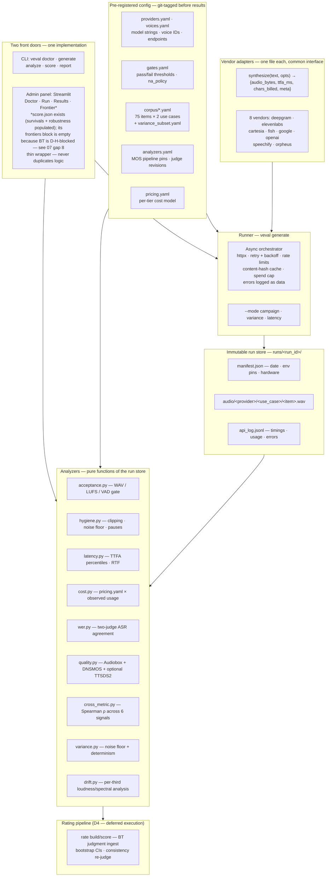

# 01 · Technical Architecture

*How the evaluation harness is built. The design choices are
covered in [02_METHODOLOGY.md](02_METHODOLOGY.md); this document
covers the code that implements them.*

> **⚠ Scope disclaimer** · Architecture applies to v1 (as of
> 2026-08-11). See [../DISCLAIMER.md](../DISCLAIMER.md) for scope.

---

## System overview



**Design principle**: the harness has **two front doors, one
implementation**. The CLI and the Streamlit admin panel call the
same underlying functions — the admin panel is a thin wrapper.
Duplicating logic across the two would guarantee they'd drift.

---

## Repository layout

```
README.md                        entry point
DISCLAIMER.md                    scope + no-affiliation disclosure
DEVIATIONS.md                    pre-registered amendments
pyproject.toml                   uv-managed Python 3.11 env

configs/                         all pre-registered parameters
├── providers.yaml               8 vendors + endpoints
├── voices.yaml                  locked voice+model per (vendor, use case)
├── voices.T6.yaml               T6 alt-voice overlay
├── gates.yaml                   pass/fail thresholds
├── analyzers.yaml               MOS pipeline pins + WER judge revisions
├── pricing.yaml                 cost model per vendor + tier
└── hardware.yaml                reproducibility receipt

corpus/                          75-item corpus per use case (top-level, not under configs/)
├── conversational.yaml
├── narration.yaml
└── variance_subset.yaml         10-item subset for the D3/D4 noise-floor run

src/veval/                       the Python package
├── adapters/                    one file per vendor + common base
├── analyze/                     per-dimension analyzers
├── cli.py                       veval subcommand entry points
├── config.py                    Pydantic v2 config validation
├── doctor.py                    per-vendor adapter probe
├── runner/                      async orchestrator + spend cap
├── store/                       immutable run store
├── admin/                       Streamlit local dashboard
├── human/                       BT rating pipeline pieces (pair_builder,
│                                bt, loudness) — execution deferred, D-H
├── report/                      report generation helpers
└── score/                       gates.py (applies pre-registered
                                 gates), robustness.py (sweep at
                                 adjacent thresholds) — both ran in
                                 v1, receipt at analysis/campaign-
                                 20260831T175358Z/score.json (survivals
                                 + robustness blocks populated) ·
                                 correlations.py (Spearman ρ helper;
                                 receipt block is [] this pass — F-8's
                                 cross-pipeline ρ comes from
                                 analyze/cross_metric.py) · frontier.py
                                 (Pareto + Bootstrap-CI — the only
                                 piece that consumes BTFit, therefore
                                 D-H-blocked; `frontiers` block is
                                 {} in the receipt — see 07 gap 8)

analysis/                        per-run analyzer outputs (JSON — gitignored
│                                by default via `analysis/*`; specific
│                                subdirs un-ignored so they ship in git —
│                                see .gitignore for the full un-ignore list)
├── verification/                Phase 2c per-test verdicts (evidence — in git)
├── campaign-*/                  R2/R3 primary campaign outputs (in git)
├── latency-*/                   per-session latency + ping (in git)
└── variance-*/                  3-draw variance subset (in git)

runs/                            immutable audio + logs (gitignored — regenerable)

documentation/                   this directory
├── 01_ARCHITECTURE.md           you are here
├── 02_METHODOLOGY.md
├── 03_RUNBOOK.md
├── 04_RESULTS.md
├── 05_CASE_STUDY.md
├── 06_KEY_FINDINGS.md
├── 07_GAPS_AND_FUTURE_WORK.md
├── figures/                     3 published PNGs
└── archive/                     superseded v1 docs

scripts/                         one-off analysis + figure generation
tests/                           pytest regression suite (~236 tests)
```

---

## The pre-registration discipline

**Every parameter that could bias a result is committed to
`configs/` and git-tagged before any campaign runs.** Tags:

- `prereg-v1` — the original 6-vendor lock, before any campaign result
- `prereg-v1.1` through `prereg-v1.10` — 10 amendment tags covering
  11 documented amendments (D-001..D-011); some tags bundle multiple
  amendments. Full rationale per amendment in
  [../DEVIATIONS.md](../DEVIATIONS.md).
- `prereg-v1.10` — the tag pointing at configs during the current
  campaign

**All config files use Pydantic v2 validation with `extra="forbid"`**
— a typo in a field name (e.g., `env_keys` instead of `env_key`)
fails at config-load, not at first API call. See
[`src/veval/config.py`](../src/veval/config.py) for the full model
set:

- `ProvidersFile` / `ProviderConfig` — vendor identity + endpoint
- `VoicesFile` / `VoiceLock` — locked voice+model per (vendor, use case)
- `CorpusFile` / `CorpusItem` — the 75-item corpus per use case
- `GatesFile` / `Gate` — pass/fail thresholds with `na_policy`
- `AnalyzersFile` — MOS pipeline pins + judge revisions
- `PricingFile` / `PricingRow` — per-vendor per-tier cost model
- `HardwareFile` — reproducibility receipt

**Judge-independence enforced by model validator** — the
`_validate_judges_independent` method on `AnalyzersFile` refuses
any pair of WER judges that share organisation OR encoder
architecture family OR training pipeline. This is the constraint
that would have been silently violated by the near-miss Canary
swap (see D-010 in DEVIATIONS.md).

---

## Adapter pattern

Each vendor is one file in [`src/veval/adapters/`](../src/veval/adapters/).
Common interface:

```python
class ProviderAdapter:
    def __init__(self, name, api_key, endpoint, ...) -> None: ...

    def synthesize(
        self,
        text: str,
        voice_id: str,
        model: str,
        opts: SynthesisOpts,
    ) -> SynthesisResult:
        """Return audio_bytes + ttfa_ms + chars_billed + meta."""
```

**SynthesisResult** always contains:
- `audio_bytes`: WAV bytes (finalized via `finalize_wav_header()`
  for streaming adapters — providers ship placeholder lengths in
  the header, e.g., Deepgram declaring 44,737s for a 2.8s clip)
- `ttfa_ms`: time from request send to first audio byte received
  (or `None` for non-streaming vendors like Speechify — see D-008)
- `total_ms`: full request/response duration
- `chars_billed`: billable characters per the vendor's own
  counting rules
- `meta`: vendor-specific context (prediction IDs, endpoint URL,
  model version SHAs) — used by post-hoc analysis (see T8's
  Replicate `predict_time` query)

**Adapter design constraints**:
1. **No shared state** between calls — each `synthesize` is
   independent
2. **Errors as data** — never raise; return a `SynthesisResult`
   with `status="error"` and a structured `error` field
3. **Rate-limit handling in the runner, not the adapter** — the
   adapter surfaces the vendor's own throttling response; the
   runner backs off

---

## The runner — async orchestration

[`src/veval/runner/runner.py`](../src/veval/runner/runner.py) is the
core loop. Uses `httpx.AsyncClient` for concurrency; adapters
themselves are sync. Per-vendor concurrency caps in
`DEFAULT_PROVIDER_CONCURRENCY` (Speechify capped at 1 by
subscription tier — D-006).

**Three execution modes**:

- **`campaign`** — 75 items × 8 vendors × 2 use cases = 1200 fresh
  or cached calls. Content-hash cache at `.cache/synthesis/`
  keyed on `(vendor, model, voice_id, text, format, sample_rate,
  version)`. Runs against the pre-committed corpus.
- **`variance`** — 10-item subset × 3 draws × 8 vendors × 2 use
  cases = 480 always-fresh calls. Cache is force-disabled
  (fresh draws *are* the measurement). Feeds `variance.py`
  noise-floor computation.
- **`latency`** — 50 serial trials per vendor on the S01 item.
  Cache force-disabled. Serial (not parallel) so each trial
  measures a real per-user tail experience.

**Spend cap** — every invocation gated by USD cap (default `$100`
via `VEVAL_SPEND_CAP_USD`; override via `--spend-cap`). Estimator
uses the **highest** rate row from `pricing.yaml` so it
overshoots rather than undershoots. Cap-exceeded submissions are
refused; in-flight calls complete; skipped calls logged as
`status="skipped"` with `reason="spend_cap_exceeded"`.

**Errors as data** — a failed call writes to `api_log.jsonl` with
`status="error"`, an error object, and any partial timing captured
before the failure. No exception propagates up to the runner —
the run finalizes with a partial result rather than crashing.

---

## The immutable run store

`runs/<run_id>/` is **never mutated in place after write**. Each
run gets its own directory:

```
runs/campaign-20260809T204608Z/
├── manifest.json                run identity + env pins + hardware
├── api_log.jsonl                one line per synthesis call
└── audio/
    └── <provider>/
        └── <use_case>/
            └── <item_id>[_dr<N>].wav
```

`manifest.json` captures date, region, Python interpreter version,
uv-lock hash, hardware.yaml snapshot, model+voice pin versions
from `voices.yaml`. This is what makes a run reproducible —
another person on another machine at another date can compare
their `manifest.json` against ours and know exactly what was
different.

**`api_log.jsonl`** is append-only during the run, one JSON per
line. Every call — success or failure — is logged. This is what
enables analyzers to be pure functions: they read the log +
audio, compute their JSON output, done.

**Immutability convention** is enforced by convention, not by
filesystem lock. If you want to change something in a run store,
you generate a new run.

---

## The analyzer chain — pure functions

Each analyzer in [`src/veval/analyze/`](../src/veval/analyze/) is a
pure function of `runs/<run_id>/`. Same input → same output. Reruns
are safe. No state leaks between analyzers unless one reads
another's output (e.g., `cross_metric.py` reads `quality.json`;
`variance.py` optionally reads `wer.json` + `quality.json`).

**Common infrastructure** in
[`src/veval/analyze/common.py`](../src/veval/analyze/common.py):

- `RunReader(run_dir)` — iterates the api_log + resolves audio paths
  (handles Windows/Linux path separator differences transparently)
- `AudioRecord` — one WAV + the api_log row that produced it
- `AnalysisWriter(run_id)` — writes JSON atomically (temp file +
  `os.replace`) so an interrupted write never leaves a half-JSON

**Per-stage entry points** — each analyzer exports a `run(run_dir,
*, writer, ...) -> dict` function that the CLI wires up.

### Quality analyzer specifically

[`src/veval/analyze/quality.py`](../src/veval/analyze/quality.py)
runs three separate loops:

1. **TTSDS2** — full benchmark suite against pre-registered
   references (skippable via `--skip-ttsds` — D-A)
2. **Audiobox Aesthetics** — 4 axes emitted, 2 pre-committed for
   reporting (see D-B rationale)
3. **DNSMOS via speechmos** — 4 axes, all reported. ONNX runtime;
   no torch conflict with Audiobox. Refuses inputs with peak ≥ 1.0
   (F-4a behavior); refusals classified as
   `input_peak_out_of_range` with observed `peak_abs` attached.

Output shape:
```json
{
    "audiobox_by_provider": [{"provider": ..., "use_case": ..., "audiobox_means": {...}}],
    "dnsmos_by_provider": [...],
    "audiobox_files": [...],    // per-file detail
    "ran_ttsds": false,
    "ran_audiobox": true,
    "ran_dnsmos": true,
    "dnsmos_axes_reported": ["p808_mos", "ovrl_mos", "sig_mos", "bak_mos"],
    "audiobox_axes_reported": ["production_quality", "content_enjoyment"]
}
```

### Cross-metric analyzer

[`src/veval/analyze/cross_metric.py`](../src/veval/analyze/cross_metric.py)
is downstream of `quality.py`. Reads `quality.json`, produces the
6×6 Spearman ρ matrix per use case + rank tables + the F-8 headline
finding.

Not part of the original spec — added post-Phase-2 when the two-MOS-
pipeline design made cross-pipeline agreement a first-class question.
Pure function; adds ~1 second to analyzer runtime.

### WER analyzer

[`src/veval/analyze/wer.py`](../src/veval/analyze/wer.py) runs two
independent ASRs (Meta wav2vec2-large-robust + OpenAI faster-whisper-large-v3)
and computes agreement WER. Judge selection enforced by
`AnalyzersFile._validate_judges_independent` at config-load time.

The `jiwer` library computes edit distance; our normalizer
(`normalise_v1`, hashed in `analyzers.yaml`) handles the case
normalization + number expansion.

---

## The CLI

[`src/veval/cli.py`](../src/veval/cli.py) uses Typer. Subcommands:

- `veval doctor` — per-vendor adapter probe
- `veval generate` — campaign / variance / latency runs
- `veval analyze` — analyzer chain
- `veval rate {build,normalize,serve,fit}` — Phase F human A/B
  rating pipeline (execution deferred, D-H)
- `veval score` — apply gates + gate-robustness sweep + Pareto
  frontiers + cross-metric Spearman. **What actually shipped in
  v1**: (a) the gate + sweep halves ran to a committed artefact
  (`analysis/campaign-20260831T175358Z/score.json`; `survivals`
  has 16 entries, `robustness` has 8);
  (b) 04's headline gate-outcome tables were adjudicated
  independently from the per-analyzer JSON flags
  (`gate_clipped_samples_pass`, `gate_long_stratum_noise_floor_pass`,
  etc.) and from comparing `long_stratum_rtf_p50` against the
  threshold — that is, the docs' gate claims come from the analyzer
  outputs directly, and the `score.json` from `veval score` is a
  second receipt that agrees on the same survivors; (c) the
  frontier half is D-H-blocked (`frontiers: {}` in the receipt —
  no BTFit input) — see gap 8 in
  [07_GAPS_AND_FUTURE_WORK.md](07_GAPS_AND_FUTURE_WORK.md); (d)
  `veval score`'s own `correlations` block is `[]` in the receipt
  (the code path exists but produced no output on this pass) —
  F-8's cross-pipeline Spearman ρ comes from a different module,
  [`src/veval/analyze/cross_metric.py`](../src/veval/analyze/cross_metric.py),
  and its output lives in `analysis/campaign-*/cross_metric.json`,
  not in `score.json`
- `veval report` — generate memo + case study (partial in v1)
- **Not implemented**: `veval invites` — a tokened-invite-URL
  builder for a rating panel was described in the spec but never
  written; v1 tester workflow used the local `veval rate serve`
  page directly. Would need adding before a remote-rater
  execution of the D-H BT panel.

Each subcommand has consistent flags: `--providers-file`, `--voices-file`,
`--analyzers-file`, `--corpus-dir`, `--analysis-dir` (all default to
sensible paths under `configs/` and `analysis/`).

---

## The admin panel

[`src/veval/admin/`](../src/veval/admin/) is a Streamlit dashboard —
runs locally, no auth (private). Pages:

- **Doctor** — vendor status matrix with re-run buttons
- **Run** — trigger a `generate` invocation with filter UI
- **Results** — browse analyzer outputs per run
- **Rate** — the local A/B rating page (BT judgment collection —
  execution deferred per D-H, so this page collects judgments but
  no v1 run produced enough to fit a BT model)
- **Frontier** — interactive Pareto chart with vendor toggles;
  reads the `frontiers` block inside `analysis/score.json`. The
  score.json file itself exists (survivals + robustness are
  populated), but the `frontiers` block is `{}` because
  [`src/veval/score/frontier.py`](../src/veval/score/frontier.py)
  is D-H-blocked (no BTFit input — see
  [07 gap 8](07_GAPS_AND_FUTURE_WORK.md)). The page is wired
  and will render as soon as that block populates.

**Design constraint**: the admin panel never duplicates the logic
in `src/veval/`. Every page is a thin wrapper that imports and
calls the same functions the CLI does. This ensures the admin
panel and CLI never diverge.

---

## The BT rating pipeline (partially implemented, execution deferred)

[`src/veval/human/`](../src/veval/human/) implements the
Bradley-Terry pieces:

- **`pair_builder.py`** — per-rater manifest generator with
  order randomization + blinded codes
- **`bt.py`** — Bradley-Terry MLE fit + clustered-bootstrap
  difference-CI computation (spec §4.3 line 398)
- **`loudness.py`** — LUFS normalisation for A/B clips

CLI surface exists at `veval rate {build,normalize,serve,fit}`
— judgment collection via `serve`, manifest build via `build`,
per-clip normalisation via `normalize`, BT fit via `fit`.

Two pieces described in the spec are **not implemented** in v1
and would need writing before a remote-rater execution of the
D-H BT panel: (a) `veval invites` — a tokened-invite-URL builder
for panel recruitment (the local `veval rate serve` was used for
tester workflows in v1); (b) a wire between `veval rate fit`
output and `veval score` (`src/veval/score/frontier.py` consumes
a `BTFit` object but there is no glue that reads `veval rate fit`'s
output into it). Both would extend the pre-registered scoring
model from partial to complete on this dataset. See
[07 § gap 8](07_GAPS_AND_FUTURE_WORK.md).

---

## Testing

[`tests/`](../tests/) has ~236 pytest tests covering:

- Every config schema (with intentional-error test cases)
- Every analyzer's core paths (with mock inputs where model calls
  would be too heavy)
- The run store's immutability + atomic-write guarantees
- The runner's spend-cap gating + retry logic
- The adapter interface + errors-as-data pattern
- The cross-metric Spearman + rank-inversion logic
- WAV finalization for streaming adapters
- BT judgment fitting

Run locally with `uv run pytest`. See
[`pyproject.toml`](../pyproject.toml) for the pytest configuration.
No GitHub Actions workflow is set up in v1 — CI-on-commit is not
wired up, and this is one of the honest gaps a v2 pass would
close (not currently enumerated in
[07_GAPS_AND_FUTURE_WORK.md](07_GAPS_AND_FUTURE_WORK.md) —
tracked here as the sole surface where the gap is named).

---

## Where to go next

- [02_METHODOLOGY.md](02_METHODOLOGY.md) — the *why* behind these
  design choices
- [03_RUNBOOK.md](03_RUNBOOK.md) — how to install + drive the
  system end-to-end
- [../DEVIATIONS.md](../DEVIATIONS.md) — the 11 amendments where
  the spec had to bend to reality
