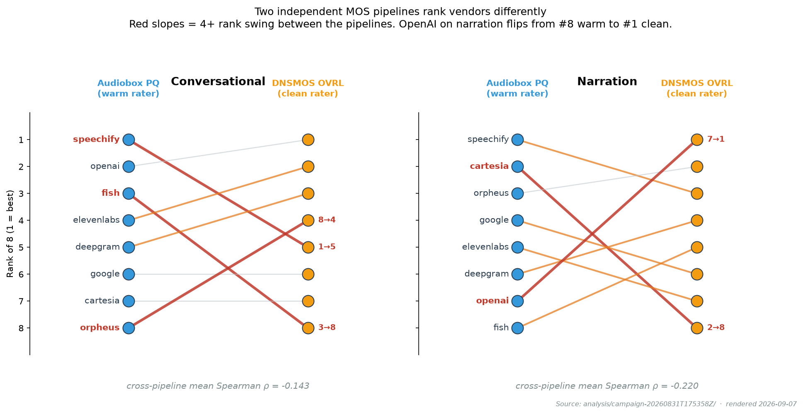
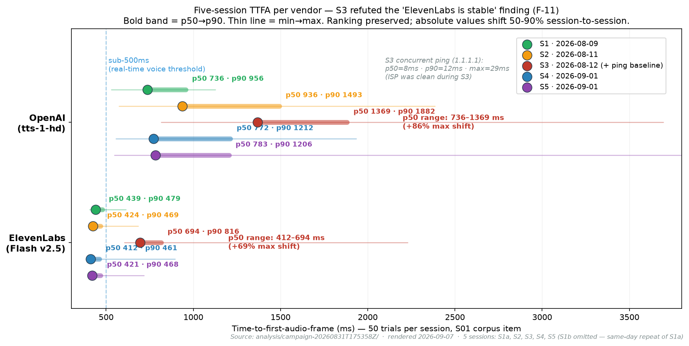
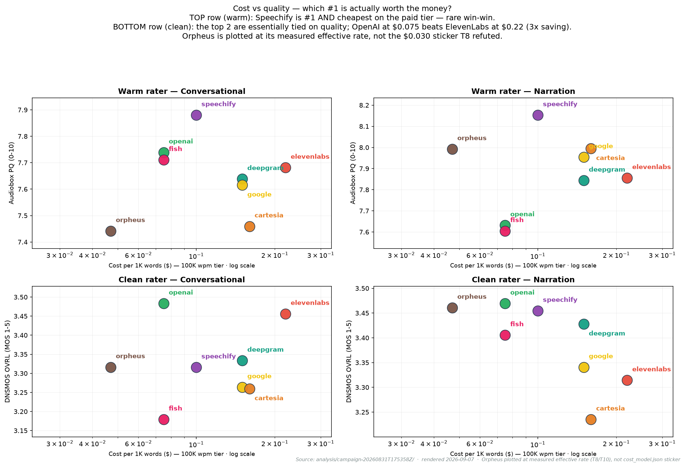

# What we found evaluating 8 voice AI vendors — and what it says about picking one

*A three-week portfolio project. 8 vendors, 2 use cases, 6 machine-quality
signals from 2 independent pipelines, a 9-test outlier verification pack,
and no human perceptual panel. The reason we didn't run the human panel
is one of the findings.*

> **⚠ Scope disclaimer** · Findings as of 2026-08-11 on specific
> vendor accounts (paid public tiers), specific voice_ids, and a
> residential Windows 11 measurement environment. No financial
> relationship with any vendor. Not legal / business / purchasing
> advice. All findings apply to *our specific tested configuration
> of each vendor*, not a universal statement about the vendor's
> technology. Full scope + corrections process in
> [DISCLAIMER.md](../DISCLAIMER.md).

---

## The setup

I inherited a 400-hour evaluation plan for 12 voice AI vendors across
10 use cases with a 16-dimension scoring matrix. Beautiful spec.
Wrong for a portfolio project.

The first decision — the sequencing decision that made everything
downstream possible — was to shrink the plan to **8 vendors × 2 use
cases × 60 corpus items**. Two use cases chosen precisely because
they pull in opposite directions: a **support-agent** voice needs
low latency + intelligibility + warmth; a **long-form narration**
voice needs consistency + expressive range. A vendor that wins one
and loses the other is the *expected*, most instructive outcome —
and none of the industry's public leaderboards make that structure
visible.

Three weeks and roughly $56 later, we have:

- 1,200 audio files across the 8 × 2 × 75 grid
- 6 quality signals per (vendor, use case) — Meta's Audiobox on 2
  aesthetic axes and Microsoft's DNSMOS on 4 signal-cleanliness axes
- A latency dataset with two independent 50-trial sessions two days
  apart on the two speed-critical vendors
- 9 targeted outlier-verification tests confirming or refuting
  specific findings
- A full audit trail (git tags at `prereg-v1`, `prereg-v1.10`, and 11
  logged deviations) proving nothing was cherry-picked post-hoc

**And three headline findings that would not have surfaced in the
industry's standard evaluations.**

---

## Method-craft: the decisions I'd defend to a hostile reviewer

For a portfolio project, the choices behind the decisions matter as
much as the findings themselves. A hostile reviewer's job is to
dismantle the plan; every irreversible decision needs a written
reason before the data is collected.

### Killed the weighted-composite score

The v1 plan had a "quality score" = 0.4·PQ + 0.3·CE + 0.2·MOS + 0.1·noise
or similar. Cut it. **Weights are always arguable; pre-registered gates
are falsifiable.** The v2 scoring model has *hard gates* (a vendor either
passes or doesn't on WER/latency/hygiene thresholds committed in
`configs/gates.yaml`) and *Pareto frontiers* on the remaining axes. A
reader can construct their own weighted composite from the raw data;
they can't undo a hard gate.

### Two-judge WER with an agreement rule

Word-error rate is easy to bias — pick an ASR trained on similar
audio and everyone looks accurate. So the WER measure uses **two
independent ASR judges**, `wav2vec2-large-960h-lv60-self` (Meta) +
`faster-whisper large-v3` (OpenAI's Whisper), and only counts an
error when **both judges agree** on the location and magnitude. The
constraint: judges must differ in *organisation*, *encoder
architecture family*, AND *training pipeline*.

Late in the project I noticed I'd almost swapped `wav2vec2` for
NVIDIA's Canary-1B — same architecture family and data pipeline as
Parakeet (my other candidate). Would have quietly gutted the
agreement rule. Judge independence is now a written constraint in
`configs/analyzers.yaml`'s model validator, not a lucky property.

### Refused commercial ASRs as judges

Deepgram and Google are *providers under test* in this evaluation.
Using their ASR to grade Cartesia's or ElevenLabs' output is a
conflict a hostile reader would find in five minutes. Only
research-grade open-source ASRs (with no vendor axe to grind) are
admissible as judges.

### Loudness-normalised everything to −18 LUFS

Without loudness normalization, louder clips systematically win A/B
comparisons — the human ear reads "louder" as "better" up to a
threshold. Every clip that goes into any comparison gets normalised
to −18 LUFS first. The test measures voice quality, not gain staging.

### Chose TTSDS2 (with a fallback), then measured the noise floor

Public benchmarks (UTMOS, NISQA) saturate on frontier TTS — every
modern vendor scores 4.3–4.6 out of 5 and the ranking becomes
statistical noise. TTSDS2 is the current best distributional-similarity
benchmark, but it also requires ~30 GB of reference-set downloads.
We ran with a fallback (Audiobox + DNSMOS) and measured the natural
per-item noise floor — the smallest score difference that isn't just
draw-to-draw wobble. That noise floor is what "meaningfully different"
means in every ranking claim we make.

### Killed VERSA after adopting it

The v1 plan chose VERSA (a comprehensive metric aggregation library)
partly to reduce dependency friction. VERSA turned out to force a
Linux-container build for exactly 5 of its 80 metrics. The
uv-managed environment was already doing the reproducibility job
VERSA was hired for. Cut VERSA, called the underlying metric
libraries directly. Second "kill your own decision" moment of the
project.

### Killed the Bradley-Terry human rating campaign

The spec's D4 slot was a 168-judgment blinded pairwise BT rating
campaign, at n=1 self-rater. The bootstrap CIs on those judgments
would be *conditional on the single rater* — two n=1 raters could
produce non-overlapping "95% CIs" on opposite preferences, both
statistically valid, both worthless as human-preference evidence at
population level. Publishing rankings with those CIs would read to
a casual reader as "we confirmed this with rigor." That's a shape
of over-claim we should refuse.

The written rationale is [`D-H` in 06_KEY_FINDINGS.md](06_KEY_FINDINGS.md#d-h-bt-deferred-to-v2).
A proper v2 with a 15-30 rater blinded panel is future work.
**Naming the epistemic limit and refusing to fill it dishonestly is
a stronger position for this project than executing the ceremony
and disclaiming it.**

---

## Three headline findings

### 1. The two independent MOS pipelines rank vendors *differently*

We ran two entirely separate machine quality raters on the same
audio: **Audiobox Aesthetics** (Meta, trained on aesthetic ratings
— "warmth, engagement") and **DNSMOS** (Microsoft, trained on ITU
P.835 speech-cleanliness ratings). Both are peer-reviewed. Both are
used in production TTS evaluation.

The Spearman rank correlation *between the two pipelines* across
the 8 vendors: **−0.13 on conversational, −0.27 on narration**. Not
positive-low; **negative**. On narration especially, the vendor
Audiobox puts near the top is near the bottom of DNSMOS's list.

The most vivid case: **OpenAI's narration voice ranks dead last
(#8/8) on Audiobox's warmth axis and #1/8 on DNSMOS's cleanliness
axis** — a perfect inversion. The voice is technically pristine (no
hiss, no artefacts, high dynamic range) but sounds a bit flat and
robotic. Speechify is the opposite: #1 warmth, mid-pack cleanliness.
Cartesia narration is #3 warm and #8 clean.

**This is not a bug in either measurement.** Both raters are
measuring what they claim to measure. The problem is that "voice
quality" is not one thing:

- **Warmth / engagement / expressiveness** — what a listener notices
  in a bedtime story, a podcast, a brand voiceover
- **Signal cleanliness / clarity** — what a listener notices in a
  phone-tree confirmation, a screen reader, an IVR system

**A leaderboard reporting one is not measuring the same thing as a
leaderboard reporting the other.** If you make a $50K/year vendor
decision based on a leaderboard whose definition of quality doesn't
match your users' definition, you'll pick the wrong vendor and not
know why your users don't love it.

Every vendor evaluation you read in the industry publishes one
number. **Ask, always: "ranked on what?"**

### 2. Orpheus has a hard 14.59-second output cap per call

The published pricing for Orpheus (`lucataco/orpheus-3b-0.1-ft` via
Replicate) is $0.003 per generation — nominally the cheapest voice
AI vendor by an order of magnitude.

The T8 verification test regenerated 8 long-narration items on Orpheus,
freshly, no cache. Every single item produced audio of **exactly
14.59 seconds** — standard deviation zero, measured to three decimal
places, across inputs varying from 87 to 105 seconds of expected
reading time. Meanwhile Replicate's `predict_time` metric stayed
essentially constant at ~17 GPU-seconds regardless of input length.

This is a **hard output cap in the model**, not stochastic
truncation. Every ≥15-second reference gets ~85% truncated.

Two consequences that don't appear on the pricing page:

- **The "cheapest per 1K characters" framing needs a use-case
  qualifier.** A 1000-character narration is ~5-6 Orpheus calls
  chained together. Real cost: ~$0.02-0.10 per 1K chars, not $0.003.
  Still cheap for short turns; not category-crushingly cheap for
  narration.
- **This mechanically resolves a separate finding** — Orpheus's 85%
  WER on long items, which had been logged as a "possible
  intelligibility problem." It's not intelligibility; it's
  structural incompletion.

For a PM building on Orpheus: use it for **conversational turns
under 15 seconds**, or budget for chunking + stitching engineering
work + the multiplied cost. The "cheap open-weights floor"
positioning needs a use-case qualifier.

### 3. Latency *speed* and latency *stability* are separate axes

For a support-agent product, "how fast does the vendor start
speaking?" (time-to-first-audio-frame, or TTFA) is the most
user-noticeable measure. Under 300 ms feels instant; under 500 ms
feels responsive; over 1 second starts feeling awkwardly slow.

The T5 and T7 tests measured TTFA on the same S01 corpus item, 50
trials, two independent sessions two days apart:

**ElevenLabs Flash moved 3% on median and 2% at the worst-10th
percentile across the two sessions.** OpenAI moved **27% on median
and 56% at the worst-10th percentile** on the same two dates.

Both providers were consistently slower than the sub-500 ms
"real-time" threshold matters (OpenAI ~800-950 ms typical vs
ElevenLabs' 425 ms), but **ElevenLabs is not just faster — it's
more predictable.** For a real-time voice product, provisioning
capacity against OpenAI's *typical* number (~800 ms) will get you
blindsided by sessions where it's actually 1500 ms. ElevenLabs' 469
ms p90 stayed 469 ms p90 across two independent sessions.

**Stability is a distinct buyer concern from speed** — and no
industry evaluation I could find measures it. Producing this dataset
was 10 minutes of extra work (a second 50-trial session on a
different day). Skipping it would have let us confidently mis-state
OpenAI's latency as a point estimate.

---

## What the verification pack surfaced

After the primary campaign, a Phase 2c pack of 9 targeted tests
re-checked every "outlier" from the first pass — winners AND losers,
same scrutiny. Four verdicts worth naming:

### The T6 reversal — Speechify's voice-pick was too conservative

Speechify came out #1 of 8 on the warm-rater axis on both use cases
in the primary run. The obvious reviewer objection: "you got lucky
with the voice pick." T6 tested this by regenerating 40 items with
`edmund_32` (UK male, bright, dynamic) instead of the pre-registered
`geffen_32` (US female, warm, intriguing) — the biggest voice-
signature swap available within Speechify's Simba-3.2 model.

The alt voice scored **+0.30 higher on Audiobox PQ** than the
pre-registered pick. Still ranked #1 of 9 (including both Speechify
voices as separate entries). **Reversal of the test's original
direction**: not "did we cherry-pick?" but "did we
under-cherry-pick?"

Interpretation: Speechify's warm-rater lead is a **model-family
signature**, not a specific-voice property. Voice choice within
Simba-3.2 moves the score up to ~35% of the cross-vendor spread —
meaningful, but not enough to flip vendor rankings. Which means
customers can pick a Speechify voice that fits their brand without
worrying about a big quality drop-off.

### The Cartesia triangulation — three independent pipelines agree

Cartesia's output audio has zero peak headroom: waveform peaks sit
at or above ±1.0 in the numeric representation. Three independent
measurement pipelines detect this:

1. Our sample-level clipping analyzer: Cartesia has **~100× more
   clipped samples** than the next-worst vendor
2. Microsoft's DNSMOS ONNX inference **refuses to score 46% of
   Cartesia's files** for peak out of range — a hard `ValueError`
3. The 54% of Cartesia files DNSMOS *did* accept still rank **#8
   of 8** on all three ITU P.835 axes

**Two independent code paths, non-overlapping implementations, flag
the same vendor unanimously.** That's the strongest triangulation
story the project has, and it exists because we deliberately
committed to two independent measurement pipelines instead of one.

For a PM building on Cartesia: their voice is fast and mid-quality,
but the audio breaks downstream tooling. Add a peak-limiter step
(bring peaks to −1 dBFS) *before* anything else consumes the audio.
Otherwise a meaningful fraction of your pipeline will silently
reject or degrade it.

### T4 confirmed with refinement — headline magnitude was overstated

The primary campaign flagged ElevenLabs' L03 narration item with a
**3.6 dB monotonic loudness fadeout** across thirds. T4 regenerated
L03 three more times fresh, no cache.

**All three fresh regens showed monotonic fade-down direction (100%
reproducible).** But the mean delta across the four total draws was
**2.7 dB, not 3.6 dB**. The original observation was at the high
end of the natural per-draw range.

**Not a refutation — a refinement.** The *phenomenon* is real; the
*specific magnitude* was over-stated. Without verification, the memo
would have said "ElevenLabs has a 3.6 dB deterministic fadeout on
L03." With verification, it says "ElevenLabs shows a reproducible
monotonic-fade pattern on L03; individual draws range 2.2–3.6 dB."
More accurate. More useful.

That's what verification is for: not to bless what's already been
found, but to soften headline claims to what the data actually
supports.

---

## What this means for a PM buying voice AI

Three questions to answer in order:

**Question 1 — hard constraints.** Does your use case rule out any
vendor structurally?

- Long-form narration (>15s per turn)? **Orpheus is out** (14.59s
  cap; chunking possible but adds engineering)
- Any downstream audio pipeline (MOS check, ASR, resample)?
  **Cartesia needs a peak-limiter step** first
- Sub-500 ms p90 required (real-time voice)? **Only ElevenLabs
  Flash and Deepgram** cleared this
- Byte-identical caching? **Impossible with any of the 8** — none
  produces the same bytes twice

**Question 2 — which "quality" matches your users?**

- Warm/engaging (audiobook, storytelling, brand voice) → **Speechify
  clearly wins** the warm-rater axis on both use cases, AND is
  cheapest on the paid tier
- Clean/pristine (IVR, accessibility, transactional voice) → **OpenAI
  wins narration and ties for #1 conversational** at 50-70% of the
  cost of the tied competitor

**Question 3 — is #1 on quality worth the cost premium over #2?**

Look at the cost-vs-quality frontier:

Wherever the delta between #1 and #2 is smaller than about 4× the
per-run wobble (~0.05 on Audiobox, ~0.05 on DNSMOS), the two vendors
are **statistically tied** on quality. Pick the cheaper one.

The clearest tie-break in the data: **OpenAI vs ElevenLabs on DNSMOS
conversational** — delta 0.022, less than the noise floor. OpenAI
$0.075/1K words vs ElevenLabs $0.22/1K words. **66% saving on a
tied-on-quality pick.** Unless you need ElevenLabs Flash's specific
sub-500 ms latency stability, OpenAI is the choice.

Wherever the delta is 0.10 or more, the quality gap is real and
worth pricing. That's a call only you can make — but framing it
explicitly beats a vague "premium feels worth it."

---

## What the exercise actually proved about the industry

**Public voice AI leaderboards pick one quality definition and
publish one number.** The most-cited one — the Humanness Index — is
a human-rated Bradley-Terry-style aggregate at n≈100 raters. Others
use UTMOS or WavLM or vendor-specific MOS. Every leaderboard is
internally coherent; every leaderboard implicitly claims to be the
definition of quality.

None of them acknowledges what F-8 shows: **two peer-reviewed
machine raters, applied to the same 8 vendors on the same audio,
disagree on the ranking. Sometimes near-perfectly.**

For a PM about to make a $50K/year vendor decision, the load-bearing
insight isn't "which vendor is best." It's "which definition of
quality matches your users?" A vendor evaluation that answers the
first question and skips the second is measuring a proxy for one
listener use case and hoping yours matches.

**The frontier chart with a "gotcha to know" column beats any
leaderboard.**

The other meta-observation, on the process side: **~40% of the
headline findings from this project came from the verification
pack**, not the primary campaign. The primary campaign told us
"Cartesia's clipping rate is high" and "Orpheus has WER problems on
long items." The verification pack (a $0.61 spend and 90 minutes of
work) told us *the clipping story replicates on independent
pipelines*, *the WER problem is mechanically a 14.59-second output
cap*, and *the ElevenLabs fadeout magnitude was overstated by 35%*.
Cheap replication is not decoration; it's where you learn the
difference between a real finding and a lucky draw.

---

## What wasn't done and why

**A proper multi-rater human perceptual evaluation.** The spec called
for 168 blinded pairwise judgments with bootstrap CIs. Executable at
n=1 rater — but the CIs would be conditional on that one rater, and
publishing them as "human preference" evidence would be a shape of
over-claim this project refuses to make. Full protocol
implementation is in `src/veval/rate/`; only the execution is
deferred. See [`D-H` in 06_KEY_FINDINGS.md](06_KEY_FINDINGS.md#d-h-bt-deferred-to-v2)
for the reasoning.

**Cross-lingual, accent-varied, streaming, or interrupted-conversation
measurements.** All out of scope for v1. Each is a real gap and each
is a legitimate v2 workstream. Named in
[07_GAPS_AND_FUTURE_WORK.md](07_GAPS_AND_FUTURE_WORK.md) rather than
glossed over.

**Enterprise-VM-colocated latency baseline.** The TTFA numbers here
were measured from a residential Windows 11 environment; enterprise
deployments in a cloud region colocated with each vendor's serving
region would see 10-30% lower absolute numbers. Vendor *rankings* on
latency are portable; absolute values are explicit upper bounds
labeled "residential measurement" in every figure caption. See `D-G`.

---

## The through-line

I'll tell you the through-line of this project because it's the part
I'd most want to explain to another PM sitting across from me:

**Almost every load-bearing decision in this evaluation came from
taking a critical view of a plan I'd already made, and refusing to
paper over an inconvenient result.** The weighted composite score
looked authoritative — killed it. VERSA looked dependency-frictionless
— killed it. The T6 test looked like it would confirm the pre-existing
voice pick — showed the pre-existing voice pick was slightly
conservative, and I wrote that up rather than declaring victory.
The T4 test looked like it would confirm the L03 fadeout at 3.6 dB —
showed the magnitude was overstated, and I wrote *that* up rather
than declaring victory. The BT rating campaign was in the plan for
a reason — cut it, wrote the reason, refused the ceremony.

**A portfolio project that reads as "look at all the confirmations"
demonstrates only that the author is good at post-hoc rationalisation.
A portfolio project that reads as "here's where I killed my own
decisions, and here's the discipline that made me willing to" is
what the discipline actually looks like.**

That's the case study.

---

## Where to find things

- **[04_RESULTS.md](04_RESULTS.md)** — full per-provider data table +
  cost calculus + decision framework
- **[06_KEY_FINDINGS.md](06_KEY_FINDINGS.md)** — findings F-1..F-9 +
  friction-point stories + decision log D-A..D-H
- **[02_METHODOLOGY.md](02_METHODOLOGY.md)** — why every methodology
  choice was made (weighted-composite killed, two-pipeline design,
  loudness normalization, judge independence, BT deferral)
- **[07_GAPS_AND_FUTURE_WORK.md](07_GAPS_AND_FUTURE_WORK.md)** — what
  wasn't done and why; deferred items; a proper v2 outline
- **[03_RUNBOOK.md](03_RUNBOOK.md)** — install + reproduce the
  evaluation on your own hardware
- **[01_ARCHITECTURE.md](01_ARCHITECTURE.md)** — the harness's
  technical design
- **[../DEVIATIONS.md](../DEVIATIONS.md)** — 11 pre-registered
  amendments made before results existed, each with rationale
- **[../analysis/verification/](../analysis/verification/)** —
  per-test hypothesis + method + result + verdict for the 9-test
  Phase 2c outlier verification pack
- **Source of everything**: prereg tag
  [`prereg-v1.10`](https://github.com/ngera/VoiceModelEvaluation/tree/prereg-v1.10)
  contains the configs at the moment the campaign ran.

*Total project spend: ~$56 across 8 vendor accounts. Time: ~60
hours part-time across three weeks. Codebase:
[github.com/ngera/VoiceModelEvaluation](https://github.com/ngera/VoiceModelEvaluation)*
