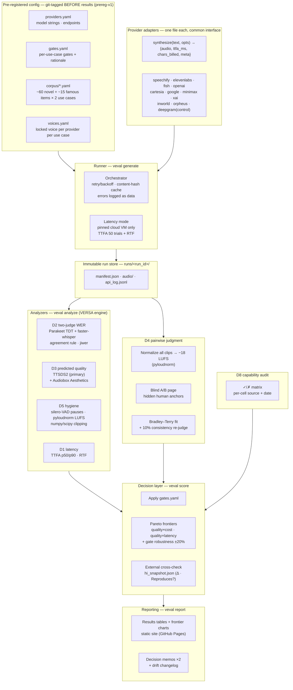
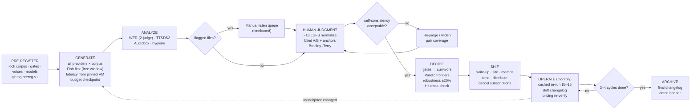

# Voice AI Provider Evaluation — Descoped Plan v1

**One person · ~4 weeks at 15–20 hrs/week · budget ceiling $100 · portfolio emphasis: product-management thinking**

The full spec (12 providers × 10 use cases × 16 dimensions) is a strong reference document, but running it requires ~20 human recruits, enterprise on-prem access, and 400+ hours. This plan deliberately cuts it down to something one person can execute end-to-end — and treats **the descoping itself as the portfolio artifact**. The story this project tells is: *"Given a sprawling evaluation problem, here is how I framed the decision, chose what to measure, what to cut and why, and turned noisy data into a defensible recommendation."* That is a PM story, with an engineering harness as supporting evidence.

---

## 1. Framing: the product question this answers

Do not frame the project as "benchmark 12 voice providers." Frame it as a decision memo for a concrete (hypothetical but realistic) product scenario:

> **Scenario:** "We are building (a) a customer-support voice agent and (b) an audio version of our written content (long-form narration). Which TTS provider should we use for each, at what cost, and what are the risks?"

Two use cases, chosen because they pull in **opposite directions** — this is what makes the analysis interesting:

| Use case | What dominates | What barely matters |
|---|---|---|
| **Conversational support agent** | Latency (TTFA), cost per session, reliability | Emotional range, long-session quality |
| **Long-form narration** | Naturalness, listener fatigue, cost per 1K words | Latency |

A provider that wins one and loses the other is the expected — and most instructive — outcome. Everything else from the full spec's 10 use cases (medical, legal, navigation, wellness…) moves to "Future work."

---

## 2. What was cut from the full spec, and why (the PM signal)

Keep this table in the final write-up. Showing disciplined descoping *is* the portfolio piece.

| Full-spec element | v1 decision | Rationale |
|---|---|---|
| 12 providers | **Rescoped to the Humanness Index roster** (7 core + 4 stretch + 1 off-index control) | Self-serve APIs only; aligning with HI's provider set makes every result cross-referenceable against their published humanness/latency/price figures |
| 10 use cases | **Cut to 2** | Two contrasting use cases demonstrate the method; eight more add cost, not insight |
| 16 dimensions | **Cut to 7** | Keep everything automatable + a small disciplined perceptual layer; cut everything requiring recruited humans |
| Human rater panels (4.2, 4.6) | **Replaced** with modern predicted-quality models (TTSDS2 + Audiobox Aesthetics) + blind pairwise self-listen, clearly labeled | 3-rater panels are statistically thin anyway; predicted scores are reproducible and free. Honesty about n=1 beats false rigor |
| Domain experts (4.4) | **Cut** | Pharmacist/lawyer recruitment is not viable solo; jargon handling still partially covered by round-trip WER on the jargon battery |
| Accent testing (4.9, 3.11) | **Cut, flagged as best v2 candidate** | Requires 8 native evaluators + 6 speakers; genuinely underserved area, so it's the strongest future-work headline |
| 30-day reliability monitor (4.8) | **Replaced** with published status-page/SLA review + error-rate observations logged during test runs | 518K synthetic calls measure your account tier, not the provider; 30 days hard-gates the timeline |
| SDK integration builds (4.13, 4.14) | **Replaced** with a scoped "developer experience" dimension: time-to-first-audio in one Python script, from docs alone | Building React + React Native + Node integrations for 6 SDKs is a second project |
| On-prem / local latency (4.15, 4.16) | **Cut** | Requires enterprise contracts a solo evaluator cannot obtain |
| Agent-layer testing (4.10, 4.11, 4.12) | **Cut** | Tests the LLM more than the voice layer; TTS-only comparison keeps the matrix clean |
| Telephony surfaces | **Cut** | Phone-number provisioning and PSTN testing add cost and scope for one column of data |

---

## 3. Scope

### 3.1 Providers — rescoped to match the Humanness Index roster

The provider list now mirrors the 11 providers on Vapi's Humanness Index, so every result in this project can be cross-referenced against their published humanness, latency, and price figures. Providers are tiered: **Core** (run everything) and **Stretch** (add if Week 2 goes smoothly). Verify capabilities and pricing in Week 1 — vendor tables go stale fast.

| Provider (model) | HI rank/score | Tier | Access | Notes |
|---|---|---|---|---|
| Speechify (Simba 3.2) | #1 · 99 | Core | Self-serve API | Their top claim — auditing the #1 is the headline test |
| ElevenLabs (Eleven v3 / Flash v2) | #2 · 97 | Core | Self-serve API | Quality leader; test both quality and flash tiers |
| Fish Audio (S2.1-Pro) | #3 · 97 | Core | Self-serve API | 141ms + $15 listed — best value claim on the board |
| OpenAI (gpt-4o-mini-tts) | ranked | Core | Self-serve API | Ecosystem default most teams reach for |
| Cartesia (Sonic) | ranked | Core | Self-serve API | Latency leader; speed-vs-quality trade-off |
| Google (Cloud TTS) | ranked | Core | Self-serve API | Hyperscaler baseline |
| MiniMax (Speech 2.8) | #5 · 91 | Core | Self-serve API (intl.) | Strong score at mid price; check data-residency terms |
| xAI (Grok TTS) | #4 · 94 | Stretch | Self-serve API | New entrant; API is public |
| Inworld (TTS-1.5-max) | ranked | Stretch | Self-serve API | Was in parent spec; gaming-first archetype |
| ~~PlayHT~~ | ranked | **Excluded — defunct** | None | Meta acquired PlayAI; platform shut down Dec 31, 2025. HI still lists it — cite this in the write-up as evidence of leaderboard staleness |
| Canopy Labs (Orpheus) | ranked · open source | Stretch | Self-host (or hosted inference) | The open-source baseline — "how close is free?" is a great chart |

**Optional off-index control (recommended):** keep **Deepgram (Aura-2)** as a 12th provider. The Humanness Index only admits cloning-capable models, which structurally excludes full-stack/budget providers (Deepgram, Polly, Azure). Testing one excluded provider lets the write-up show what cloning-gated leaderboards miss — a differentiated finding, not just a replication.

**Dropped from the previous v1 list (not on the Humanness Index):** Amazon Polly (and Deepgram, unless kept as the control above). From the parent spec's original 12, also not on HI: Azure Speech, Vapi itself, Telnyx, Speechmatics, and Vocal Bridge — mostly agent platforms and STT engines outside a TTS-humanness benchmark's scope.

### 3.2 Voice selection protocol (fixes the biggest confound in the parent spec)

"Default settings" really benchmarks each provider's default voice. Instead:

- For each provider × use case, select the voice the provider itself recommends for that use case (docs, voice-library tags). Document the voice ID and the selection reasoning in a `voices.md` log.
- One voice per provider per use case. No cherry-picking after hearing results — the selection is locked before any scoring.

### 3.3 Corpus

Reuse the existing corpus doc — it's already built. Take the two relevant use-case corpora as-is:

- Conversational: 5 short + 5 medium + 2 long + 20 jargon + 10 edge = 42 items
- Narration: same structure = 42 items

**Corpus is rebuilt, not inherited (hybrid design).** The parent project's corpus items are reviewed but carry no default status. Final structure per use case:

- **~60 custom novel items** — curated/trimmed from the existing corpus after review (fix AI-generation artifacts, verify jargon items are actually hard), guaranteed absent from any provider's training data because they are original text.
- **~15 famous public sentences** (Harvard sentences, well-known literary openings) as a **training-contamination probe**: if a provider renders famous text measurably better than novel text of equal difficulty, that's evidence of memorization benefit — a side-finding nobody currently publishes.

**Total: ~75 items × 2 use cases × 7 core providers ≈ 1,050 audio files per full run** (more with stretch tier). Still ~15–20K words per provider — comfortably inside free credits for most. If the stretch tier strains the timeline, run stretch providers on short + medium items only and skip their long-passage batteries.

---

## 4. Dimensions & methodology (7, with the statistical fixes)

| # | Dimension | Method | Fixes vs. parent spec |
|---|---|---|---|
| D1 | **Latency — TTFA + RTF** | Automated; streaming mode; run from one pinned cloud region | **50 trials** per provider, split across ≥2 days and ≥2 times of day; **p50/p90 only**. Plus **RTF (real-time factor / throughput)** on long passages — the latency metric that actually matters for narration, which TTFA-only designs miss |
| D2 | **Round-trip WER** | Synthesize → transcribe with a **two-judge ASR protocol**: NVIDIA Parakeet TDT (primary — tops the Open ASR leaderboard for English) + faster-whisper large-v3 (adjudicator) → jiwer | Errors both ASRs agree on are attributed to the TTS; disagreements are discarded as ASR noise — this beats any single-judge design. Report as a **comparative signal, not an absolute**; manual listen on flagged files. Never use a commercial ASR as judge (Deepgram/Google are under test — conflict of interest) |
| D3 | **Predicted perceptual quality** | **TTSDS2** (primary — purpose-built to rank modern human-quality TTS) + **Audiobox Aesthetics** (Meta, secondary) on every file | Replaces the human panel. UTMOS/NISQA dropped: UTMOS is trained on 2022-era systems and saturates on frontier TTS; NISQA is a telephony-degradation model, not a naturalness judge. Always labeled "predicted" in charts; sanity-checked against D4 |
| D4 | **Blind pairwise listening (Arena-style)** | Script serves random blinded A/B pairs (same corpus item, two providers); you pick "more natural / better register fit"; fit results with Bradley–Terry/Elo into a ranking. Include **hidden human-recorded anchors** (a few corpus items read by a real person) in the pair pool. Re-judge a 10% sample a week later for self-consistency; optionally send the same voting page to 5–10 friends for cheap n>1 | Pairwise judgments are far more reliable than absolute 1–5 scales at small n — this is the same design the Humanness Index and TTS-Arena use. The human anchor calibrates the scale ("distance from human"); still labeled n=1 (or n≈10) honestly |
| D5 | **Audio hygiene** | numpy/scipy (clipping, clicks) + **silero-VAD** (speech/silence segmentation for unnatural-pause detection) + **pyloudnorm** (EBU R128 loudness) | Upgraded from plain librosa: VAD-based silence detection avoids false flags on soft speech, and LUFS measurement catches loudness inconsistency across providers. Critically: **all clips are loudness-normalized (−18 LUFS) before D4 pairwise listening** — otherwise "louder" wins A/B tests |
| D6 | **Cost modeling** | Spreadsheet from published pricing + actual character counts logged by the harness | Model three volumes (10K / 100K / 1M words per month) **and cost per support-session** for the conversational case. Note minimums, per-request fees, "contact sales" walls. Date-stamp the pricing |
| D7 | **Developer experience (scoped)** | Time from "open docs" to "first audio plays" in a fresh Python venv, per provider; log every friction point | Replaces 4.13/4.14. One environment, one script, one afternoon total — but produces the most quotable findings ("Provider X: 11 minutes; Provider Y: 74 minutes and an undocumented header") |
| D8 | **Capability audit** | Desk research per provider: voice count, languages, cloning, SSML/style/speed controls, streaming protocols (WS/SSE/chunked), word timestamps, SLA & compliance terms, pricing model shape | Half a day total; unscored checklist matrix (✓/✗/partial), date-stamped. Feeds gates and decision memos directly — half of a real buying memo is capability facts, not measurements |

**Explicitly not measured, stated in the report:** human-panel MOS, accent fidelity, domain-expert pronunciation, reliability-over-time, agent-layer quality, multi-surface SDK parity. Each gets one line on what it would take to add.

### 4.0 Tooling: build vs. borrow (evaluated, not inherited)

Every tool choice was re-derived after dropping the parent spec's defaults:

| Layer | Decision | Rationale |
|---|---|---|
| Analyzer engine | **Borrow: VERSA** (CMU WAVLab) as the metric backbone — one YAML config, 80+ standardized speech metrics | Standard implementations beat hand-rolled scripts for credibility and coverage; actively maintained |
| Distributional quality | **Borrow: TTSDS2** (not in VERSA core) | Purpose-built to rank modern human-quality TTS; UTMOS-era predictors saturate on frontier systems |
| WER math | **Borrow: jiwer**; ASR judges = Parakeet TDT + faster-whisper (two-judge, agreement-based) | Never use a commercial ASR as judge — Deepgram/Google are under test |
| Hygiene primitives | **Borrow: silero-VAD, pyloudnorm**, numpy/scipy | VAD-based silence detection and EBU R128 loudness beat energy thresholds; all clips loudness-normalized to −18 LUFS before human A/B |
| Orchestration | **Build (~500 lines):** adapters, runner, immutable run store, report generator | The thin layer that is actually specific to this project |
| LLM eval frameworks (promptfoo, DeepEval, Inspect, Braintrust, LangSmith) | **Skip — considered and rejected** | Built for text-in/text-out with LLM-judge scorers; wrong shape for an audio API under acoustic metrics |
| Experiment-tracking SaaS (W&B Weave, Braintrust) | **Skip** | The immutable file-based run store does this with zero infra; a self-contained repo is the better portfolio artifact |

### 4.1 External benchmarks as free data (D3/D4 cross-check)

Don't rebuild what already exists — integrate it and position against it:

- **Vapi's Humanness Index** (crowd-sourced blind A/B voting, ~12K votes, 21 models, single cloned voice, one customer-service script) and **TTS-Arena** publish perceptual rankings with statistical power no solo project can match. Pull their current rankings as an external column in the decision matrix.
- **Compare your pairwise ranking against theirs.** Agreement validates your method; divergence is a finding to explain (different scripts, different voices, narration vs conversational content).
- **Note their gaps explicitly — they define your lane.** The Humanness Index leaderboard does list a latency figure (ms) and a price figure ($) per model, but both are single spec-sheet-style numbers: no published measurement methodology visible (region, percentile, trial count, streaming vs buffered), no volume tiers, no per-session cost, no minimums/fees. Beyond that, it measures one perceptual dimension on one conversational script, only for cloning-capable models, with no WER/accuracy, jargon handling, long-form content, audio hygiene, DX, or decision framework. Your project is the *decision layer*: measured p50/p90 latency with documented method, cost modeled at three volumes and per-session, and rankings like theirs consumed as one input among seven.
- **Validation angle (cheap, high-credibility):** your D1 latency campaign covers several models on their board (ElevenLabs, Cartesia, Inworld, OpenAI, Google). Publish a "do their numbers reproduce?" comparison — e.g., does ElevenLabs Flash v2's listed 226ms hold at p90 from your region? Independently checking a vendor-published benchmark is a strong portfolio element on its own.
- **Design alternative to document in the write-up:** the Humanness Index controls the voice confound by cloning one voice across all models; this plan instead locks each provider's *recommended* voice per use case. Rationale: you're evaluating what a buyer actually deploys (cloning support varies, cloning fidelity becomes a confound of its own, and it excludes non-cloning providers). Acknowledging this trade-off consciously is part of the PM story.

---

## 5. Decision framework: gates + Pareto frontier (where the PM thinking shows)

The parent spec's weighted composite is **rejected** — weights are always arguable, and a single blended score hides the trade-offs a buyer actually navigates. Replaced with the way procurement decisions really work:

1. **Hard gates per use case, committed to git before any results exist.** Examples: support agent — TTFA p90 < 400ms, no clipping artifacts, commercial use permitted on an accessible tier; narration — RTF > 3× real-time, no audible artifacts over long passages. A provider that fails a gate is out of that use case regardless of how good it is elsewhere. Gate rationale documented in one sentence each.
2. **Pareto frontier analysis on survivors.** Two plots per use case: perceived quality (D4 pairwise score) vs. cost, and quality vs. latency. Providers on the frontier are defensible choices; dominated providers (worse on both axes than some alternative) eliminate themselves — no weighting debate required.
3. **Raw metrics stay raw.** No 1–5 band conversion (also parent-spec inheritance, also dropped). Tables show measured values with uncertainty ranges; the frontier plots do the synthesis.
4. **Sensitivity becomes gate-robustness.** Instead of weight sensitivity: would the frontier change if a gate moved ±20%? ("Cartesia only makes the support frontier because the 400ms gate excludes X — at 500ms, X re-enters and dominates it.")
5. **Decision memo per use case** (1 page each): the frontier chart, recommendation with the trade-off it implies ("cheapest voice on the frontier" vs "best voice on the frontier"), cost at three scale points, top three risks (pricing drift, model deprecation, vendor lock-in), and revisit-triggers ("re-evaluate if provider ships X / raises price Y%").

---

## 6. Timeline — 4 weeks at 15–20 hrs/week

| Week | Theme | Output |
|---|---|---|
| **1** | **Frame & build** — write the 2-page eval brief (scenario, dimensions, **gates + rationale committed to git**, what's cut and why); curate hybrid corpus (review inherited items, add famous-sentence probe set); run D8 capability audit (feeds gates); get API keys; build the harness (adapters, runner, immutable run store, VERSA config); lock voice selections | Eval brief · gates.yaml · corpus v1 · capability matrix · working harness · `voices.md` |
| **2** | **Automated runs** — D1 latency + RTF campaign (spread across days), D2 two-judge WER pipeline, D3 TTSDS2/Audiobox scoring, D5 hygiene + loudness; all results to versioned JSON/CSV | `latency.json` · `wer.json` · `quality.json` · `audio_quality.json` |
| **3** | **Judgment layer** — D4 blind pairwise sessions (loudness-normalized clips, + consistency re-rate), D7 DX timings, D6 cost model spreadsheet; apply gates, build Pareto frontiers + gate-robustness check | Judgments CSV · cost model .xlsx · frontier charts |
| **4** | **Ship** — two decision memos; public write-up (blog-style: method, findings, charts, honest limitations); results heatmap/leaderboard visual; clean the repo (README that lets a stranger re-run everything); retro section: "what I'd do with a $10K budget" (summarize the full spec as future work) | Memos · write-up · public repo |

Buffer is built in: if Week 2 slips (it will — API quirks always eat a day), Week 3's self-listen and cost model are compressible.

> **Timeline honesty note (added in red-team review):** scope has grown since this table was written (hybrid corpus curation, D8 audit, VERSA/toolchain setup, friends rating round). Either plan **5 weeks**, or hold 4 by deferring the stretch-tier providers to the first monthly re-run (campaign 2). Deferring is the recommended default — it also gives the drift changelog its first real content.

---

## 7. Budget

| Item | Estimate |
|---|---|
| TTS synthesis, 7–12 providers × ~2 full runs | $60–90 per Appendix B (Deepgram/Fish/xAI/Google free via credits; ElevenLabs ~$22 and MiniMax ~$15–25 are the big lines) |
| Whisper transcription | $0 (local large-v3; needs a GPU or patience — or ~$5 hosted) |
| UTMOS/NISQA | $0 (open source, local) |
| Cloud VM for pinned-region latency runs | $0–10 (small instance, hours not weeks) |
| Everything else (librosa, jiwer, spreadsheets) | $0 |
| **Total** | **~$30–65, ceiling $100** |

---

## 8. Deliverables (mapped to the portfolio story)

1. **Evaluation brief** — the PRD-equivalent: problem framing, scope decisions, weight rationale. *(PM: problem definition & prioritization)*
2. **Descoping table** (Section 2 of this plan, refined) — *(PM: ruthless scoping under constraints)*
3. **Decision matrix + sensitivity analysis** — *(PM: structured decision-making, comfort with uncertainty)*
4. **Two 1-page decision memos** — *(PM: crisp recommendations with risks and revisit-triggers)*
5. **Public write-up with charts** — *(PM: communication; the artifact people actually read)*
6. **Re-runnable open repo** — *(supporting evidence of execution; also makes staleness a feature: "re-run monthly")*

### 8.1 Published results table — target format

The headline artifact mirrors the Humanness Index leaderboard layout, then extends it with measured and decision-grade columns they don't publish. One table per use case, plus the HI reference columns for direct cross-checking. All values below are **illustrative placeholders** — shapes, not results.

**Table A — Conversational support agent** *(sorted by use-case composite)*

| Rank | Provider · Model (voice used) | Humanness — ours¹ | Humanness — HI² | Δ | Pred. quality³ | TTFA p50/p90 ms — ours⁴ | Latency — HI² | Reproduces?⁵ | WER band⁶ | Hygiene | DX min⁷ | $/1K words @100K/mo⁸ | $/session⁸ | HI price² | Status⁹ |
|---|---|---|---|---|---|---|---|---|---|---|---|---|---|---|---|
| — | Human recording (anchor) | 100 | 100 | — | — | — | — | — | — | — | — | — | — | — | — |
| 1 | Fish Audio · S2.1-Pro (voice-id) | 88 | 97 | −9 | 4.3 | 120 / 165 | 141 | ✓ | A | ✓ | 18 | $0.9 | $0.04 | $15 | **On frontier** |
| 2 | Cartesia · Sonic (voice-id) | 82 | — | — | 4.1 | 45 / 70 | — | — | A | ✓ | 25 | $1.2 | $0.05 | — | **On frontier** |
| 3 | ElevenLabs · Flash v2 (voice-id) | 85 | 77 | +8 | 4.2 | 190 / 260 | 226 | ✓ | B | ✓ | 15 | $2.5 | $0.11 | $50 | Dominated by Fish |
| … | … | | | | | | | | | | | | | | |
| 9 | Deepgram · Aura-2 (voice-id) | 74 | **not listed**¹⁰ | — | 3.8 | 80 / 110 | — | — | A | ✓ | 20 | $0.6 | $0.03 | — | **On frontier** (value) |

**Table B — Long-form narration** — same columns, minus $/session, plus a listener-fatigue note from the long-passage items. Expect a different winner; that divergence is the story.

Footnotes published with the table:
1. Blind pairwise A/B (Bradley–Terry fit, human-anchored to 100; clips loudness-normalized to −18 LUFS), n and rater composition disclosed. 2. Vapi Humanness Index values as of [date], their methodology. 3. TTSDS2 + Audiobox Aesthetics — model-predicted, not human-rated. 4. Measured: 50 trials, ≥2 days, streaming, [region]; p50/p90 (+ RTF for narration). 5. Whether HI's listed latency falls within our measured p50–p90 range. 6. Comparative two-judge round-trip WER band (A = top tier), not absolute accuracy. 7. Time from docs to first audio, fresh environment. 8. Published pricing on [date] + our logged character counts; minimums/fees noted. 9. Final column shows **gate + frontier status** per use case (e.g., "On frontier", "Dominated by X", "Gated: TTFA") rather than a weighted composite — see Section 5. 10. Off-index control — excluded from HI by its cloning requirement.

The "Δ" and "Reproduces?" columns are the differentiators: no one else publishes an independent audit of the Humanness Index's own numbers next to a buying recommendation.

---

## 9. Risks & mitigations

| Risk | Mitigation |
|---|---|
| Free-tier limits / rate limits mid-run | Log usage from day 1; harness retries with backoff; corpus is small enough to re-run |
| Whisper errors misattributed to providers | Manual listen on every flagged file; report WER comparatively, never as absolute truth |
| n=1 listening judged as weak | Own it: blinding script, self-consistency check, predicted-MOS cross-check, and explicit labeling |
| Results stale within months | Date-stamp everything; design the repo to re-run in <1 hr; frame v1 as a snapshot with a method, not eternal truth |
| Scope creep back toward the full spec | Any new idea goes to the "Future work" section, not the v1 plan. The descoping table is a contract with yourself |

---

## 10. Future work (v2 candidates, in priority order)

1. **Accent robustness** — the most underserved niche in public voice evals; smallest viable version: 3 accents × recruited raters on Prolific (~$150–300).
2. Add a third contrasting use case (e.g., navigation — ultra-short utterances).
3. Small human MOS panel (5–7 raters) on the top-3 providers only.
4. Agent-platform layer (Vapi / OpenAI Realtime / Deepgram Voice Agent) as a separate, comparably-scoped project.
5. Scheduled monthly re-runs → longitudinal "provider drift" tracking, which no one else publishes.

---

---

## Appendix A — The measures: what, how, why

One subsection per dimension. Each covers: **what it measures**, **how we run it**, **how it works** (the mechanics), and **why it matters** (the product decision it informs). This appendix doubles as the "Methodology" section of the eventual public write-up.

### A.1 · D1 — Latency (time-to-first-audio)

**What it measures.** The elapsed time from sending the synthesis request to receiving the first audio byte (TTFA), in streaming mode. This is the number that determines whether a voice agent feels responsive or laggy — not total generation time, because streaming playback begins as soon as the first chunk arrives.

**How we run it.** A Python harness (`httpx`/`aiohttp`) timestamps immediately before the API call and again on arrival of the first audio byte. 50 trials per provider on corpus item S01, spread across at least 2 different days and 2 times of day, all from one pinned cloud region (small VM, no VPN). We also spot-check a medium and long item to see whether TTFA degrades with input length. Results: p50 and p90 only — 50 samples cannot support p99 claims. **For narration, we additionally measure RTF (real-time factor):** total synthesis time ÷ audio duration on the long passages — batch throughput, not first-byte speed, is what matters when generating hours of audio.

**How it works.** TTFA is dominated by four components: network round-trip to the provider's nearest edge, queueing/cold-start on their side, model time-to-first-token, and chunk encoding. Testing from a pinned region holds the network term roughly constant across providers, so differences mostly reflect the provider stack. Multi-day sampling catches time-of-day load effects that single-session tests miss.

**Why it matters.** In conversation, response gaps above roughly 500–600ms read as hesitation and increase caller interruptions; for narration, latency is nearly irrelevant. This is the clearest example of why one leaderboard number can't drive a decision — the same measurement carries a 30% weight in one use case and 5% in the other. It's also our audit hook: the Humanness Index lists one latency figure per model with no published method; we check whether it falls inside our measured p50–p90 range.

### A.2 · D2 — Round-trip WER (synthesis fidelity)

**What it measures.** Whether the provider actually says the words it was given. We synthesize each corpus item, transcribe the audio back to text with two independent open ASR models, and compute word error rate against the source text.

**How we run it.** All corpus items per provider → audio at the provider's highest quality tier → transcription by a **two-judge panel**: NVIDIA Parakeet TDT (primary — currently the top open English model on the Open ASR leaderboard) and faster-whisper large-v3 (second judge, architecturally unrelated) → normalization (lowercase, strip punctuation, expand numbers) → WER via `jiwer`, run through VERSA's standard pipeline where supported. Errors **both** judges hear are attributed to the TTS; errors only one hears are discarded as ASR noise. Flagged files get a manual listen.

**How it works.** WER = (substitutions + deletions + insertions) ÷ total words. Any single ASR judge conflates its own errors with the TTS's — the two-judge agreement rule filters most of that confound, because two unrelated ASR architectures rarely make the *same* mistake on clean audio. We deliberately exclude commercial ASR APIs as judges: Deepgram and Google are providers under test, and judging competitors with their models is a conflict of interest. We still report WER **comparatively** (bands, same items, same judges) rather than as absolute truth.

**Why it matters.** A gorgeous voice that drops a word in "your refund of $84.99" is worse than a plain voice that doesn't. The jargon and edge-case batteries (numbers, dates, acronyms, currency) are where real products break — and where humanness-only leaderboards are silent. This dimension is also the honest replacement for the parent spec's unachievable "0% WER" legal disqualifier.

### A.3 · D3 — Predicted perceptual quality (TTSDS2 + Audiobox Aesthetics)

**What it measures.** A model-predicted estimate of how a human listener panel would judge each provider's output quality — the scalable stand-in for the human panels we cut.

**How we run it.** Two independent predictors on every file: **TTSDS2** (primary) and **Meta's Audiobox Aesthetics** (secondary — production-quality and enjoyment axes). Aggregated per provider per use case and script type. Every chart labels these "predicted" — never presented as human ratings.

**How it works — and why not UTMOS/NISQA.** Classic MOS predictors (UTMOS, NISQA) were trained on 2022-era synthesis and **saturate on modern frontier TTS** — everything scores 4.3–4.6 and the ranking becomes noise; NISQA is additionally a telephony-degradation model, not a naturalness judge. TTSDS2 takes a different approach: instead of predicting a rating, it measures how closely the *distribution* of the synthetic speech (prosody, speaker characteristics, intelligibility factors) matches real human speech — a design that stays discriminative on human-quality systems and correlates with human judgment across domains (SSW 2025 / ICLR 2026). Audiobox Aesthetics provides an architecturally unrelated second opinion.

**Why it matters.** Free, reproducible, covers every file. Cross-checked against D4 (our pairwise judgments) and the Humanness Index's crowd rankings, it gives three independent perceptual signals — agreement is strong evidence, disagreement is a finding. Choosing current-generation predictors over the parent spec's defaults is also part of the story: tool choices were re-derived, not inherited.

### A.4 · D4 — Blind pairwise listening (Arena-style)

**What it measures.** Which provider's rendering of the *same* text a listener prefers, judged blind, aggregated into a ranking on a human-anchored 0–100 scale — methodologically the same family as the Humanness Index and TTS-Arena, which lets us publish a direct Δ column against their scores.

**How we run it.** A script builds randomized A/B pairs (same corpus item, two providers, filenames stripped to codes), **all clips loudness-normalized to −18 LUFS first** — without this, louder clips systematically win A/B tests and the results measure gain staging, not quality. Presented in a simple local web page; the judge picks "more natural / better register fit for this use case." A few corpus items recorded by a real human are seeded into the pool as hidden anchors. Judgments are fit with a Bradley–Terry model; the human anchor pins the top of the scale. 10% of pairs are re-judged a week later to measure self-consistency; optionally the same page goes to 5–10 friends for n≈10.

**How it works.** Pairwise comparison outperforms absolute 1–5 rating at small n because humans are much better at "which is better?" than "how good is this on a fixed scale" — absolute ratings drift with mood, sequence, and anchoring. Bradley–Terry converts win/loss records into latent strength scores (the same math behind chess Elo), and confidence in the ranking grows with pair count rather than rater count.

**Why it matters.** Predicted MOS (D3) can't hear register fit — whether a voice sounds right *for this use case* — and n=1 absolute scoring would be dismissed on sight. Blind pairwise with a human anchor and a published self-consistency number is the most defensible perceptual judgment one person can produce, and it makes our humanness column directly comparable to the Humanness Index's.

### A.5 · D5 — Audio hygiene (noise, artifacts, silences)

**What it measures.** Technical cleanliness of the generated audio: background noise floor, signal-to-noise ratio, clicks/pops, hard clipping, and unnatural silences longer than 400ms that don't correspond to sentence boundaries.

**How we run it.** Clipping and click detection via numpy/scipy (samples pinned at ceiling; short high-amplitude spikes); speech/silence segmentation via **silero-VAD** so "unnatural pause" flags are based on actual voice activity rather than energy thresholds (which false-flag soft or breathy speech); loudness measured per **EBU R128 (LUFS) via pyloudnorm**; noise floor from the quietest VAD-confirmed non-speech window. VERSA supplies standard implementations where available. Providers with 3+ flagged artifacts get a manual listen.

**How it works.** Clean synthesis should have a noise floor below about −60dBFS; values above −40dBFS are audibly hissy. Clipping — waveform samples flattened at the ceiling — indicates gain mishandling and is unfixable downstream. LUFS measures perceived loudness the way broadcast standards do; providers ship at wildly different levels, which matters twice — once as a production-quality fact, and once methodologically, because clips must be loudness-matched before any human A/B comparison (see A.4).

**Why it matters.** Artifacts are invisible in short demo clips but corrosive over a 10-minute narration or a hold-music-free support call. It's also a cheap tripwire: a provider that clips or hisses at its *highest* quality tier tells you something about its engineering that no humanness score will.

### A.6 · D6 — Cost modeling

**What it measures.** What each provider actually costs at realistic volumes — not the list price, but the modeled bill: three monthly volumes (10K / 100K / 1M words) for narration, and cost-per-support-session for the conversational case.

**How we run it.** The harness logs actual character/token counts from every API response during testing. A spreadsheet applies each provider's published pricing (pulled and date-stamped on analysis day, per the parent spec's good advice), including per-request fees, monthly minimums, tier cliffs, and "contact sales" walls. Session cost = characters in a typical 8-turn support exchange × rate.

**How it works.** Providers price in incompatible units — per character, per 1M characters, per second of audio, per hour of agent time — and quietly differ on whether spaces, SSML tags, or retries count. Using *our own logged counts* against *their published rates* normalizes everything to $/1K words and $/session, and surfaces the gap between headline price and effective price (rounding, minimums) that spec-sheet comparisons miss.

**Why it matters.** At 1M words/month, the spread between the cheapest and most expensive provider on our list is likely one to two orders of magnitude — dwarfing most quality differences in business impact. The Humanness Index shows one flat price per model; the volume-tiered model plus session cost is what a buyer actually needs, and it's where "PM thinking" is most visible.

### A.7 · D7 — Developer experience (time-to-first-audio)

**What it measures.** How long it takes, starting from the provider's documentation and a fresh Python virtual environment, to hear the first audio — plus a friction log of every obstacle on the way.

**How we run it.** One measured session per provider: start the clock at "open docs," stop it when audio plays from a working script. Log every friction event — signup hurdles, key provisioning, missing/wrong code samples, undocumented headers, confusing errors. Same developer for all providers (necessarily true solo), run in a consistent order and noted as such.

**How it works.** This is a deliberately scoped proxy for the parent spec's 4.13/4.14 (three-platform SDK builds, cut as a second project). One environment kills the breadth but keeps the discriminating signal: docs accuracy, auth design, error message quality, and SDK ergonomics all compress into that one wall-clock number and its friction list.

**Why it matters.** Integration cost is part of the buying decision, and DX findings are the most quotable part of any eval write-up ("11 minutes vs. 74 minutes and an undocumented header"). It also produces the risk notes for the decision memos — a provider whose docs are wrong at hello-world will be wrong at scale.

### A.8 · The decision layer: gates + Pareto frontiers

**What it does.** Turns D1–D8 measurements into a recommendation per use case — without a weighted composite (rejected as parent-spec inheritance: weights are always arguable, and a blended score hides the trade-offs buyers actually navigate).

**How we run it.** Step 1: hard gates per use case, committed to git *before* results exist, each with a one-sentence rationale (support agent: TTFA p90 < 400ms, no clipping, commercial-use tier accessible; narration: RTF > 3×, clean long-passage audio). Step 2: survivors plotted on two Pareto frontiers per use case — quality (D4) vs. cost, and quality vs. latency. Step 3: gate-robustness check — would the frontier change if any gate moved ±20%? Report where it would.

**How it works.** A provider is *dominated* if another survivor is better on both axes; dominated providers eliminate themselves with no weighting debate. What remains — the frontier — is the set of defensible choices, each representing a different trade-off ("best voice money can buy" vs. "90% of the quality at a fifth of the price"). Pre-committed gates play the same anti-tuning role weights did, with git history as the receipt. Raw metrics stay raw throughout — no 1–5 band conversion.

**Why it matters.** This mirrors how real procurement decisions work: requirements first, then trade-offs among qualified options. It's more honest than a composite (nothing is hidden in weights), more resistant to argument, and the frontier chart is the single most communicative artifact the project produces. "X is dominated by Y for this use case" is a sentence a leaderboard can never say.

### A.9 · D8 — Capability audit

**What it measures.** The factual feature surface per provider: voice count, languages, cloning availability and gating, SSML/style/speed controls, streaming protocols (WebSocket/SSE/chunked), word-level timestamps, SLA and compliance terms, pricing-model shape (PAYG vs. plans vs. credits).

**How we run it.** Desk research against official docs, ~30 minutes per provider, recorded as a ✓/✗/partial matrix with a source link and date per cell. No scoring — facts, not judgments.

**How it works.** Cell-level sourcing keeps it auditable and makes staleness visible ("checked 2026-08-01"). The matrix feeds the gates (e.g., "commercial use on accessible tier" comes from here) and fills the half of a buying memo that measurements can't answer.

**Why it matters.** Real provider selections die on capability facts as often as on quality — no SSML control, cloning gated behind enterprise tiers, no word timestamps for karaoke-style highlighting. Ten measurements can't tell you a feature doesn't exist. This was missing from both the parent spec and the first descope; adding it closes the gap between "benchmark" and "buying guide."

---

## Appendix B — Provider onboarding: accounts, connectivity, and costs

Manual setup steps and verified costs per provider. Researched and date-stamped **August 1, 2026** — re-verify pricing on analysis day (D6 rule). Items marked *(unverified)* could not be confirmed against official pages.

### B.0 Summary — cost and friction at a glance

Estimated project cost assumes ~250K characters per provider (84 corpus items × ~2 full runs + latency trials).

| Provider | Card needed? | Free allowance | List price ($/1M chars) | Est. project cost | Console |
|---|---|---|---|---|---|
| Deepgram (control) | No | **$200 one-time credit** | $30 (Aura-2) | **$0** | console.deepgram.com |
| Fish Audio | No | **S2.1-Pro free API until Aug 31, 2026** (no hard cap) | $15/1M bytes after | **$0** if run before Sep | fish.audio/app |
| xAI Grok TTS | No | **$25 signup credit** (+up to $150/mo data-sharing opt-in) | $15 | **$0** (credit covers ~$4 usage) | console.x.ai |
| Google Cloud TTS | **Yes** (hold, not charge) | $300/90-day trial + **1M chars/mo free** (Neural2/Chirp3 HD) | $16 Neural2 · $30 Chirp3 HD | **$0** (monthly free tier covers it) | console.cloud.google.com |
| Inworld | No (On-Demand) | ~70 min TTS free | $25 (TTS-2) · $35 (TTS-1.5-Max) | ~$5–9 | inworld.ai portal |
| OpenAI | **Yes** (prepaid credits) | None reliable | $15 (tts-1) · ~$0.015/min (gpt-4o-mini-tts) | ~$4–6 | platform.openai.com |
| Speechify | No for free tier | 50K chars/mo (hard cap) | $10/1M via Starter $10/mo | ~$10 (1 month Starter) | platform.speechify.ai |
| MiniMax (intl.) | Yes (top-up) | Trial credits *(amount unverified)* | $60 (2.8-turbo) · $100 (2.8-hd) | ~$15–25 | platform.minimax.io |
| Cartesia | No for free tier | 20K credits (non-commercial) | ~$40/1M via Pro $4/mo plan | ~$8–12 (2–3 months Pro) | play.cartesia.ai |
| ElevenLabs | No for free tier | 10K credits/mo | $50 (Flash v2.5) · $100 (Multilingual/v3) | ~$22 (1 month Creator) — **biggest line item** | elevenlabs.io/app |
| Canopy Orpheus | Hosted-inference account | Replicate/Baseten starter credits | ~$0.08/generation (Replicate, L40S) | ~$10–15 | replicate.com or baseten.co |
| ~~PlayHT~~ | — | — | — | **Defunct** (Meta acquisition; API offline since late 2025) | — |

**Estimated total out-of-pocket: ~$60–90** — inside the $100 ceiling, with Deepgram, Fish, xAI, and Google effectively free. Sequencing tip: run Fish Audio before its free-API window closes Aug 31, 2026.

### B.1 Deepgram *(off-index control — start here, it's the gentlest onboarding)*
- **Setup:** email signup, no card → create API key in console.
- **Auth:** `Authorization: Token <API_KEY>` · REST `POST api.deepgram.com/v1/speak?model=aura-2-...` · WebSocket streaming available.
- **Costs:** $200 one-time credit ≈ 6.6M Aura-2 chars — covers this entire project alone.
- **Gotchas:** per-request character limit on REST (~2K chars *(unverified)*) — chunk long passages; free-tier concurrency caps.

### B.2 Fish Audio
- **Setup:** email signup, no card → API key at fish.audio/app/api-keys.
- **Auth:** `Authorization: Bearer <key>` · REST + WebSocket streaming · Python/TS SDKs.
- **Costs:** model string `s2.1-pro-free` = free through **Aug 31, 2026** (best-effort latency, no SLA, data may be retained for training). Paid: $15/1M **UTF-8 bytes** (≈ chars for English).
- **Gotchas:** billed per byte, not per char; free tier latency numbers may not represent paid tier — run D1 latency on the *paid* model string for fairness, quality/WER runs on free.

### B.3 xAI (Grok TTS)
- **Setup:** console.x.ai account → API key; $25 credit typically without card *(third-party sourced — verify in console)*.
- **Auth:** Bearer key · `POST api.x.ai/v1/tts` (15K chars/request max) · bidirectional WebSocket at the same path · 25 voices, default `eve`.
- **Costs:** $15/1M chars (official). Our usage ≈ $4 — covered by signup credit.
- **Gotchas:** the +$150/mo data-sharing credit program trains on your API traffic — fine for a public corpus, but opt out on anything proprietary. 50 concurrent WS sessions/team cap.

### B.4 Google Cloud TTS
- **Setup:** the heaviest onboarding: Google account → Cloud project → **billing account with card** (hold only) → enable `texttospeech.googleapis.com` → service account + key (or API key).
- **Auth:** service account / ADC (or API key) · REST `text:synthesize` · streaming is gRPC-only, Chirp3-HD-only, Preview status — use buffered REST for D1 comparability and note it.
- **Costs:** 1M chars/month free on Neural2/Chirp3 HD — the whole project fits in one month's free tier. $300 trial credit on top.
- **Gotchas:** billing counts spaces and SSML tags; trial resources stop at 90 days if not upgraded; pick Chirp3 HD (their current flagship) and say so — Neural2 scores would understate them.

### B.5 Inworld
- **Setup:** portal signup, On-Demand tier, no mandatory spend → API key.
- **Auth:** API key (Basic auth) · streaming is core product; verify current WS/SSE endpoint in docs during Week 1.
- **Costs:** ~70 min TTS free, then **TTS-2 at $25/1M** (the HI board lists TTS-1.5-max — note the lineup moved on; test TTS-2 and flag the version delta vs. HI).
- **Gotchas:** credit purchases have $10 minimum; unused plan credits expire after 3 months.

### B.6 OpenAI
- **Setup:** platform account (email + phone) → **prepay credits** (card required) → API key.
- **Auth:** `Authorization: Bearer` · `POST /v1/audio/speech` · chunked streaming; no plain-TTS WebSocket (Realtime API is a separate, pricier product — out of scope, note it).
- **Costs:** tts-1 $15/1M chars; gpt-4o-mini-tts ≈ $0.015/min. Project ≈ $4–6. Credits reportedly expire after 12 months *(unverified)*.
- **Gotchas:** no free grant; rate limits scale with spend history (fresh accounts are slow-laned — create the account in Week 1, not Week 2).

### B.7 Speechify
- **Setup:** platform.speechify.ai signup → API key at /api-keys. Free tier: 50K chars/mo hard cap.
- **Auth:** `Authorization: Bearer` (`SPEECHIFY_API_KEY`) · streaming via HTTP chunked `POST /v1/audio/stream` (20K chars/req); no WebSocket · model `simba-3.2` for English/lowest latency.
- **Costs:** free cap won't cover a full run (~130K chars) → one month Starter at $10 (includes 1M chars).
- **Gotchas:** hard cap means mid-run failures on free tier — budget the $10; docs domain recently migrated, ignore old `sws.speechify.com` samples.

### B.8 MiniMax (international)
- **Setup:** platform.minimax.io (international — *not* the mainland minimaxi.com platform; separate accounts, billing, endpoints, data residency) → top-up → API key.
- **Auth:** `Authorization: Bearer` · sync HTTP T2A + WebSocket `wss://api.minimax.io/ws/v1/t2a_v2` (10K chars/synthesis) · async batch API for long passages.
- **Costs:** speech-2.8-turbo $60/1M · speech-2.8-hd $100/1M (HI ranks 2.8 at 91 — test hd to match, turbo as the value comparison). Project ≈ $15–25, the second-biggest line.
- **Gotchas:** minimum recharge and trial-credit amount unverified — confirm before committing; billing is technically per token, ratio to chars varies slightly.

### B.9 Cartesia
- **Setup:** email signup → play.cartesia.ai → API key. Free tier is **non-commercial** and 20K credits only.
- **Auth:** `X-API-Key` header · WebSocket `wss://api.cartesia.ai/tts/websocket` (version-pinned via `cartesia_version`) · HTTP/SSE also available.
- **Costs:** no pure PAYG — Pro plan $4/mo = 100K credits (1 credit = 1 char). Full project needs ~250K → 2–3 months of Pro or one month + trimmed re-runs; ~$8–12.
- **Gotchas:** listed prices assume annual billing (monthly is ~20% higher); concurrency caps are low (2 on free, 3 on Pro) — serialize latency trials.

### B.10 ElevenLabs
- **Setup:** email signup, no card → API key in dashboard. Free tier 10K credits/mo — not enough; **Creator at $22/mo (100K credits)** is the practical choice, or the $0/mo PAYG API plan at per-model rates.
- **Auth:** `xi-api-key` header · chunked HTTP streaming + WebSocket input-streaming.
- **Costs:** Flash v2.5 $50/1M · Multilingual/v3 $100/1M — **the most expensive provider on the list (~$22, biggest single line item)**. Test both Flash and v3 since HI ranks them separately (77 vs 97 — the quality/price spread is a story in itself).
- **Gotchas:** commercial use requires a paid tier; credits reset monthly without rollover *(unverified)*; cancel after the testing month.

### B.11 Canopy Labs Orpheus (open source)
- **Setup — hosted path (recommended):** Replicate account → run `orpheus-3b` (~$0.08/generation on L40S), or Baseten (official partner, FP8 on H100-MIG). No provider account, no key beyond the host's.
- **Setup — self-host path:** Apache-2.0 weights on Hugging Face; 3B model, ~15GB fp16, needs ~21GB VRAM naive / ~9GB quantized — viable on a rented GPU, not a typical laptop.
- **Costs:** ~168 generations × $0.08 ≈ $13 on Replicate; or ~2 hrs of Baseten GPU ≈ $8.
- **Gotchas:** per-run hosted pricing makes *latency* results reflect the host's cold-start + queue, not the model — score Orpheus on quality/WER/cost only and mark D1 N/A-hosted (a methodology footnote that shows care).

### B.12 PlayHT — excluded
Meta acquired PlayAI; the platform shut down Dec 31, 2025 and the API is offline. No account can be created. Keep one line in the write-up: the Humanness Index still ranks a model that cannot be purchased — the clearest possible evidence that static leaderboards drift from reality, and a free argument for this project's re-runnable design.

---

## Appendix C — Tool selection rationale

Every tool below was chosen after the parent spec's defaults were explicitly discarded (Whisper, UTMOS, NISQA, librosa). For each: what it is, what it does in this project, why it won, and what was rejected.

### C.1 VERSA — the analyzer backbone

**What it is.** VERSA (Versatile Evaluation of Speech and Audio) is an open-source evaluation toolkit from CMU's WAVLab (the group behind ESPnet). It wraps **80+ independent speech/audio metrics** — MOS predictors, WER via multiple ASRs, SNR, speaker similarity, prosody measures — behind one unified interface driven by a single YAML config.

**What it does here.** It is the engine inside `veval analyze`: one config file declares which metrics run over which audio files, and VERSA dispatches to the standard implementation of each. Our D2/D3/D5 measures run through it wherever it has coverage.

**Why it won.**
- *Credibility*: "scored with VERSA's standard metric implementations" is a stronger sentence than "scored with my own scripts" — reviewers can check the exact implementation.
- *Reproducibility*: the YAML config is committed to the repo; anyone re-running gets the identical metric stack.
- *Leverage*: it collapses what would be six separately-installed, separately-versioned metric repos into one maintained dependency.

**Rejected alternatives.** Hand-rolled metric scripts (credibility and bug risk); gluing individual metric repos manually (the dependency management VERSA already solved); LLM eval frameworks like promptfoo/DeepEval/Inspect (built for text-in/text-out with LLM-judge scorers — wrong shape for an audio API judged by acoustic models).

### C.2 TTSDS2 + Audiobox Aesthetics — predicted perceptual quality

**What TTSDS2 is.** The TTS Distribution Score (v2) takes a fundamentally different approach from classic MOS predictors: instead of predicting a rating for one clip, it measures how closely the *statistical distribution* of the synthetic speech — its prosody patterns, speaker characteristics, intelligibility factors — matches the distribution of real human speech. Published at SSW 2025 / ICLR 2026 with evidence it stays discriminative on modern human-quality systems and correlates with human rankings across domains.

**What Audiobox Aesthetics is.** Meta's open aesthetic-quality model (2025): a fast, pip-installable scorer trained on large-scale human ratings, producing axes like production quality and content enjoyment per clip.

**What they do here.** Both run over every generated file (D3). TTSDS2 is primary; Audiobox is the architecturally-unrelated second opinion. Agreement between them (and with D4 pairwise + the Humanness Index crowd ranking) is treated as signal; divergence is a finding.

**Why they won.** The parent spec's UTMOS/NISQA were rejected on a specific failure mode: UTMOS-era predictors were trained on 2022-generation synthesis and **saturate on frontier TTS** — every modern provider scores ~4.3–4.6 and the ranking degenerates into noise. NISQA has a second problem: it's a telephony *degradation* model (noisiness, discontinuity, coloration) — useful for hygiene, but it was never a naturalness judge. TTSDS2's distributional design is the current answer to the saturation problem; pairing it with an unrelated second model guards against any single predictor's bias.

**Rejected alternatives.** UTMOS/UTMOSv2 (saturation); NISQA as a quality judge (wrong construct); audio-LLM-as-judge (promising but bias-prone — optional v2 experiment, never primary).

### C.3 Two-judge WER — Parakeet TDT + faster-whisper, agreement-based

**What they are.**
- *NVIDIA Parakeet TDT*: an open ASR model (FastConformer encoder, token-and-duration transducer decoder) that currently tops the Hugging Face Open ASR leaderboard for English while running far faster than Whisper-class models.
- *faster-whisper*: the CTranslate2 reimplementation of OpenAI's Whisper large-v3 — same weights and accuracy, ~4× faster and lighter than the legacy `openai-whisper` package.

**What they do here.** Both transcribe every generated audio file (D2). WER is computed against the source text (via `jiwer`, after normalization). The **agreement rule** is the design's core: an error is attributed to the TTS provider only if *both* judges hear it; an error only one judge reports is discarded as ASR noise.

**Why this design won.** Round-trip WER's fundamental weakness is that measured error = TTS error + ASR error, inseparable with one judge. Two ASRs with *unrelated architectures and training pipelines* rarely hallucinate the same mistake on clean audio — so requiring agreement filters most of the ASR-noise term at zero cost. This directly repairs the parent spec's worst artifact (a "0% WER" legal disqualifier that single-judge Whisper noise made unachievable for every provider).

**Why no commercial ASR judges.** Deepgram and Google are *providers under test* — scoring competitors' TTS with their ASR is a conflict of interest a hostile reader will find in minutes. Commercial APIs also update silently, breaking reproducibility; both local models are version-pinned in the repo.

**Rejected alternatives.** Single-judge Whisper (the confound above); legacy `openai-whisper` package (slow, effectively unmaintained); commercial ASR APIs (conflict + reproducibility); phoneme-level forced alignment (more precise for drop/repeat detection, but heavy plumbing for marginal v1 gain — queued for v2).

### C.4 silero-VAD + pyloudnorm — audio hygiene primitives

**What silero-VAD is.** A small, fast, open neural voice-activity detector — it labels which spans of an audio file contain speech versus silence/noise, robustly across voices and recording conditions.

**What it does here.** Two jobs in D5: (1) *unnatural-pause detection* — a >400ms gap is only flagged if VAD confirms it's a true non-speech span that doesn't align with a sentence boundary; (2) locating genuine non-speech windows for noise-floor measurement.

**Why it won.** The parent spec's energy-threshold approach (via librosa heuristics) false-flags soft, breathy, or deliberately slow speech as "silence" — precisely the delivery styles the narration and wellness registers reward. A trained VAD distinguishes quiet *speech* from actual silence; a threshold cannot.

**What pyloudnorm is.** A Python implementation of the ITU-R BS.1770 / EBU R128 loudness standard — the same LUFS measurement broadcast and streaming platforms use to quantify *perceived* loudness (as opposed to raw signal power).

**What it does here.** Two jobs: (1) a hygiene metric — providers ship audio at wildly different loudness levels, which is a real production defect worth reporting; (2) the **methodological guard for D4** — all clips are normalized to −18 LUFS before any blind A/B session, because listeners systematically prefer louder clips, and without normalization the pairwise test measures gain staging instead of voice quality.

**Why they won.** Clipping/click detection needs nothing more than numpy/scipy (librosa added a dependency without adding capability); the two genuinely hard sub-problems — "is this pause real?" and "how loud does this *sound*?" — each have a purpose-built standard tool. 

**Rejected alternatives.** librosa energy heuristics (false flags); RMS as a loudness proxy (not perceptual, no standard behind it); ffmpeg `loudnorm` (works, but pyloudnorm keeps measurement inside the Python pipeline and testable).

---

## Appendix D — System architecture & functional workflow

### D.1 System architecture (component view)

### D.2 Functional workflow (process view)

---

## Appendix E — Red-team review: gaps found & feasibility fixes

Second adversarial pass over the completed plan (2026-08-01). Each finding is either fixed inline elsewhere or amended here.

| # | Finding | Severity | Fix |
|---|---|---|---|
| E1 | **Windows toolchain risk.** NeMo (Parakeet), VERSA, and TTSDS2 are Linux-first; native Windows installs are a known time sink. | High (schedule) | Run all analyzers in **WSL2 or a devcontainer** (Docker), or on the latency cloud VM. Decide in Week 1 *before* the campaign, not during. The devcontainer doubles as the reproducibility story for testers (Appendix G) |
| E2 | **GPU dependency unstated.** TTSDS2 + Parakeet + faster-whisper over ~1,000+ files want a GPU; CPU-only runs take days. | Medium | Local NVIDIA GPU if available; else a spot GPU instance for the analysis day (~$5–10, inside budget). State hardware in the manifest |
| E3 | **Pairwise volume math never done.** ~11 providers → 55 pairs × 3 repetitions × 2 use cases ≈ **330 judgments** (~2–3 hrs of listening solo). | Medium | Feasible but must be scheduled as 6–8 short sessions; if stretch tier is deferred (7 providers → 21 pairs), volume drops to ~126 judgments |
| E4 | **Friends voting page has no hosting/collection story.** "Send the page to friends" assumed a local server. | Medium | Host the static page on GitHub Pages (unlisted URL); judgments POST to a free form endpoint, keyed by per-rater token links. Fallback: raters export a results file and email it |
| E5 | **Latency geography confound.** A pinned US VM structurally penalizes providers whose nearest endpoint is distant (e.g., MiniMax international). | Medium (validity) | Record and publish each provider's serving region/endpoint next to its latency; annotate structurally-distant providers rather than pretending the comparison is clean |
| E6 | **Concurrency during latency trials unspecified.** Parallel trials would contaminate TTFA. | Low | Standing rule added: all D1 trials strictly serial, one request in flight, per provider |
| E7 | **Contamination probe is weaker than it sounds.** Famous sentences differ from novel ones in difficulty, vocabulary, and era — a clean causal claim is not available at n=15. | Medium (claims) | Report as a **directional observation**, never a headline finding; use only public-domain famous sentences (also a legal fix, see F) |
| E8 | **Human anchor quality bar missing.** A poorly-recorded human anchor could score below top TTS — which would measure the microphone, not humanness. | Medium | Anchor recordings: quiet room, decent mic, loudness-normalized like everything else; do a pilot A/B against the best TTS before locking. If recording own voice isn't viable, a consenting friend (see F, privacy) |
| E9 | **Voice/model deprecation mid-project.** A locked voice can disappear between campaign and re-run. | Low | Already mitigated by manifests + clean re-run rule; add: capability matrix records voice-deprecation events for the drift changelog |
| E10 | **No pilot run in the plan.** Full campaign starts cold. | Medium | Phase 0 smoke test upgraded: full pipeline on 5 items × all providers ("$1 pilot"), through to a toy frontier chart, before spending the real budget |

---

## Appendix F — Security, privacy & legal register

*Not legal advice — this is an engineering risk register. For anything with real exposure (especially publishing comparative results), 30 minutes with a lawyer before launch is cheap insurance.*

### F.1 Security

| Risk | Control |
|---|---|
| API keys leak via repo | `.env` only, `.gitignore` from first commit, `.env.example` with placeholders; **gitleaks/trufflehog scan in CI and pre-commit** |
| Keys leak via published run data | `api_log.jsonl` captures request metadata — **scrub auth headers and signed URLs before any run store is published**; scrubber runs as part of `veval report`, not as a manual step |
| Key abuse / runaway spend | Per-provider spend caps where consoles support them; billing alerts; keys rotated after the campaign and **always after publishing the repo** |
| Cloud VM exposure | Keys reach the latency VM as env vars only, never in images or snapshots; VM destroyed after each campaign |
| Supply chain (pip + model weights) | Pinned, hash-locked dependencies (`uv`/`pip-tools`); model weights only from official HF orgs (NVIDIA, Silero, Meta, TTSDS authors); versions recorded in manifest |
| Voting page abuse | Per-rater token links, no open voting; rate-limited form endpoint; results accepted only from known tokens |

### F.2 Privacy

| Risk | Control |
|---|---|
| Raters are identifiable | Pseudonymous rater IDs in all published data; consent line on the voting page ("aggregated judgments will be published; your identity will not") |
| Human anchor voice is biometric-adjacent personal data | If the anchor voice isn't your own: written consent to publish the recordings in a public repo, or keep anchors out of the published sample set |
| Real PII in corpus | Corpus review checklist item: all names/order numbers/amounts are synthetic; no real individuals referenced in test sentences |
| Provider-side data retention | Fish free tier retains inputs for training; xAI data-sharing credits train on traffic. Acceptable **only because the corpus is original text we intend to publish anyway** — documented as a conscious call. Nothing sensitive ever goes through test accounts |

### F.3 Legal

| Risk | Control |
|---|---|
| **ToS clauses restricting published benchmarks** (the biggest one) | Week-1 task: read each provider's ToS for benchmark/comparison clauses; record verdict as a **new column in the D8 capability matrix** ("benchmarking: allowed / conditional / restricted + link"). Where conditional (some clouds require full methodology disclosure — which we do anyway), comply and cite; where restricted, decide eyes-open and document |
| Redistributing generated audio | Output ownership/licensing varies by provider **and tier** (e.g., free tiers often non-commercial or attribution-required). License audit per provider before publishing the curated sample set; publish samples only where permitted, with attribution where required; providers that forbid it get transcript + metrics only |
| Copyright in the famous-sentence probe | Public-domain sources only (Harvard sentences, pre-1930 literature) |
| Trademark / comparative claims | Nominative use of provider names, no logos; every published claim traceable to a dated measurement; **right-of-reply emails to all providers ~1 week before publication** — good practice and good engagement |
| Confusion with "Humanness Index™" | Distinct project name; HI cited nominatively as a third-party benchmark, never echoed in branding |
| Our own licensing | Code: MIT or Apache-2.0. Data + report: CC BY 4.0. **Dependency/model license audit in Week 1** — flag any non-commercial (NC) model licenses (some Meta/NVIDIA weights carry them) and confirm compatibility with a public repo |
| Liability for conclusions | Standing disclaimer on site + repo: measurements at a stated date, methodology public, not an endorsement, no warranty; corrections policy published |

---

## Appendix G — Distribution: sharing the solution with other testers

Three audiences, three tiers of involvement, launched in order.

### G.1 Tier 1 — Reproducers ("run it yourself")

The bar: **a stranger on a fresh machine reaches a toy frontier chart in under 30 minutes and under $1.**

- Public GitHub repo (MIT), `README` quickstart, `.env.example`, `veval doctor`
- **Devcontainer/Dockerfile** as the blessed environment (solves E1 for testers too — no NeMo-on-Windows support burden)
- **Demo corpus** (5 items) + demo mode that runs against 2–3 free-credit providers (Deepgram, Fish, xAI) so reproduction costs pennies
- Pinned lockfile; model weights auto-downloaded from official sources with hashes checked
- `SECURITY.md` (key-leak reporting), issue templates, corrections policy

**Soft-launch first:** 3–5 trusted testers on fresh machines *before* any public link. Their friction log is the acceptance test — and a nice echo of our own D7 methodology pointed at ourselves.

### G.2 Tier 2 — Raters ("lend us your ears")

The cheapest way for others to materially improve the results: judgments, not code.

- Hosted blind A/B voting page (GitHub Pages, unlisted), per-rater token invite links, consent text (F.2)
- Session design: ≤20 minutes per invite, loudness-normalized clips, hidden anchors included — rater quality is measurable via anchor agreement
- Raters credited by pseudonym (or name, opt-in) on the results site; published n and rater composition update as votes arrive
- Target: 10–25 external raters lifts D4 from "n=1, disclosed" to a genuinely defensible panel — the single biggest credibility upgrade available post-launch, at zero API cost

### G.3 Tier 3 — Contributors ("extend it")

- `CONTRIBUTING.md` with the **add-a-provider guide**: copy the adapter template, implement `synthesize()`, pass the adapter conformance test (`veval doctor --provider X`), submit PR with capability-matrix row + sources
- Corpus contributions: novel items only, checklist-reviewed (synthetic PII, difficulty tags)
- Provider correction lane: dedicated issue template; corrections resolved publicly and noted in the drift changelog (F.3 right-of-reply, systematized)
- Release discipline: each campaign is a tagged release with its frozen prereg config and data; optional Zenodo DOI so results are citable

### G.4 Launch sequence

1. **Week 4 (ship)**: soft-launch to the 3–5 alpha testers; fix reproduction friction
2. **Week 5**: public repo + results site + launch post (LinkedIn/X, Show HN, relevant subreddits); right-of-reply emails already sent a week prior; HI-audit section shared with Vapi's benchmark contact
3. **Week 6+**: open the rater program to the public with tokened invites; fold external judgments into a v1.1 results update ("now n=23") — a second news moment for free
4. **Monthly**: drift changelog posts double as the community heartbeat; contributor PRs reviewed on the same cadence

---

*Parent spec retained as reference architecture. This plan supersedes its roadmap (Section 8) for solo execution.*
