# Voice AI Provider Evaluation — Specification v2

**One person · 3 weeks part-time · budget ceiling $50 · portfolio emphasis: product-management thinking under constraint**

This document merges the portfolio edition (WHAT) and the descoped plan (HOW) into
one reference, and folds in the ten findings from the external red-team pass
(`EXTERNAL_REVIEW_2026-08-06.md`). The two superseded documents stay in the repo:
the descoping table in the old plan is a portfolio artifact in its own right and is
reproduced here in §2.

**The reframe that governs everything below.** The parent spec (12 providers × 10 use
cases × 16 dimensions) was engineered for *credibility at distance* — strangers trusting
a public benchmark without meeting its author. This project runs on *credibility in
person*: it gets narrated. Every hour previously budgeted for external-proof machinery
is reallocated to making the artifacts legible and the story sharp.

What a reviewer must perceive within 10 minutes: *this person frames problems,
pre-commits criteria, kills their own bad ideas, quantifies their own uncertainty, and
turns noisy data into a defensible decision.*

---

## 0. What changed in v2

| # | Change | Driver |
|---|---|---|
| 1 | **Judge 2 is locked to faster-whisper.** Judge independence is now a stated design constraint, not an implicit property. Parakeet moves off NeMo onto HuggingFace; Canary is admissible only as an optional third judge | R1 |
| 2 | **D4 uncertainty propagates to the frontier.** Bootstrap CIs on every Bradley–Terry score; frontier points carry error bars; domination requires non-overlapping intervals; "indistinguishable at this n" becomes a first-class result category | R2 |
| 3 | **The TTSDS2 reference set is a pre-registered parameter**, with a domain-match rationale and a split-half stability check before it may carry a headline | R3 |
| 4 | **Generation variance is measured.** A 10-item subset is synthesised 3× per provider to establish the project's own noise floor; differences below it are not reported as differences | R4 |
| 5 | **Failure incidence is a published column**, separate from WER bands | R5 |
| 6 | **Listener fatigue becomes a measurement** — per-third quality drift within long passages — or it comes out of the results table | R6 |
| 7 | **Cross-metric agreement is a computed number** (Spearman ρ), not an assertion | R7 |
| 8 | **D4 sessions randomise across providers** rather than blocking, and the consistency re-judge reports its session gap | R8 |
| 9 | **The Fish free/paid tier assumption is stated** at the point of use | R9 |
| 10 | **Corpus size reconciled to 75 items per use case**; architecture diagram corrected | R10 |
| 11 | **VERSA dropped** in favour of direct library calls; Phase E becomes Windows-native and the devcontainer becomes a reproducibility artifact rather than a requirement | Analyzer-backbone decision, 2026-08-06 |

Items 2, 3, 4, 6 and 7 are the substantive ones: they change what the project can
*claim*, not merely how it is built. **Five of the eleven — changes 2, 3, 5, 6 and 7 —
cost compute rather than calendar**, which is most of why the three-week timeline holds
(§7). Of the rest, 1 and 11 are build work, 4 adds API generations, 8 is session design,
9 is desk research, and 10 is documentation.

---

## 1. Framing: the product question this answers

The project is not "benchmark six voice providers." It is a decision memo for a
concrete, realistic scenario:

> **Scenario.** "We are building (a) a customer-support voice agent and (b) an audio
> version of our written content. Which TTS provider should we use for each, at what
> cost, and what are the risks?"

Two use cases, chosen because they pull in **opposite directions**:

| Use case | What dominates | What barely matters |
|---|---|---|
| **Conversational support agent** | Latency (TTFA), cost per session, reliability | Emotional range, long-session consistency |
| **Long-form narration** | Naturalness, quality stability over minutes, cost per 1K words | Latency |

A provider that wins one and loses the other is the expected — and most instructive —
outcome. Everything else from the parent spec's ten use cases (medical, legal,
navigation, wellness) is future work.

---

## 2. What was cut from the parent spec, and why

Preserved verbatim in substance from v1 because the descoping table *is* a portfolio
artifact. Showing disciplined scoping under constraint is the PM signal.

| Parent-spec element | Decision | Rationale |
|---|---|---|
| 12 providers | **Cut to 6**, one per archetype | Providers 7–12 add coverage, not narrative. The story is identical at 6 |
| 10 use cases | **Cut to 2** | Two contrasting use cases demonstrate the method; eight more add cost, not insight |
| 16 dimensions | **Cut to 8** | Keep everything automatable plus a small disciplined perceptual layer; cut everything requiring recruited humans |
| Human rater panels | **Replaced** with distributional quality models + blind pairwise self-listen, honestly labelled | 3-rater panels are statistically thin anyway. Honesty about n=1 with quantified uncertainty beats false rigor |
| Domain experts | **Cut** | Pharmacist/lawyer recruitment is not viable solo; jargon handling survives via the WER battery |
| Accent testing | **Cut — best v2 candidate** | Requires 8 native evaluators × 6 speakers; genuinely underserved, so it is the strongest future-work headline |
| 30-day reliability monitor | **Replaced** with status-page/SLA review plus error rates logged during runs | 518K synthetic calls measure your account tier, not the provider; 30 days hard-gates the timeline |
| SDK integration builds | **Replaced** by a scoped developer-experience dimension (D7) | Building React + RN + Node integrations for six SDKs is a second project |
| On-prem / local latency | **Cut** | Requires enterprise contracts a solo evaluator cannot obtain |
| Agent-layer testing | **Cut** | Tests the LLM more than the voice layer; TTS-only keeps the matrix clean |
| Telephony surfaces | **Cut** | PSTN provisioning adds cost and scope for one column of data |
| Publication apparatus | **Cut** — results private, shown 1:1 | Kills the entire legal apparatus: no ToS review, no right-of-reply, no audio-license audit |

**Unchanged because it is the signal:** gates + Pareto decision layer, pre-registration
with git receipts, hybrid corpus with contamination probe, re-derived tooling, two-judge
WER, −18 LUFS normalisation before A/B, both use cases, the red-team discipline.

---

## 3. Scope

### 3.1 Providers — locked roster of 6

One per archetype, so the frontier chart has a story at every point.

| Provider | Archetype | Est. cost | Note |
|---|---|---|---|
| ElevenLabs | Quality leader | ~$22 (one Creator month) | Biggest line item; cancel after the campaign |
| Cartesia | Latency leader | ~$4–8 (Pro month) | Free tier is non-commercial; concurrency caps are low — serialise latency trials |
| Fish Audio | Value pick | $0 | Free `s2.1-pro` window closes **2026-08-31** — runs first (see R9 note below) |
| Google Cloud TTS | Hyperscaler baseline | $0 | 1M chars/month free tier covers the project; use Chirp3 HD, their flagship |
| Deepgram | Off-index control | $0 | $200 signup credit. Excluded from the Humanness Index by its cloning gate — which is exactly why it is here |

**Per-provider measurement constraints.** These change what a number *means* and must
travel with it into the results table:

| Provider | Constraint | Consequence |
|---|---|---|
| **Google** | Streaming is gRPC-only, Chirp3-HD-only, Preview status | **D1 runs on buffered REST for Google.** Its TTFA is therefore not comparable to the streaming figures from the rest of the roster — footnoted wherever it appears, never silently averaged in |
| **Deepgram** | Per-request character limit on REST (~2K chars) | Long-stratum items must be chunked; chunk boundaries recorded, and RTF computed over the reassembled audio |
| **Orpheus** | Replicate bills per generation; latency reflects host cold start and queue | **D1 scored N/A-hosted**; variance subset reduced to 5 items (§3.4) |
| **Cartesia** | Low concurrency caps (2 free / 3 Pro) | Latency trials serialised anyway (D1 rule); campaign concurrency capped to match |
| **Fish** | Free tier is best-effort with no SLA | Quality/WER on the free string, latency on paid — see the R9 note below |
| Canopy Orpheus | Open-source floor | ~$5–10 | Replicate-hosted; **latency scored N/A-hosted** — per-run hosted pricing means TTFA would measure the host's cold start, not the model |

Dropped to the "re-run later if curious" list: Speechify, OpenAI, MiniMax, xAI, Inworld.
The Humanness Index cross-check still works — four of the six appear on their board.

**R9 — tier assumption, stated at point of use.** Fish quality and WER run on the free
`s2.1-pro-free` model string; latency runs on the paid string, because free-tier latency
is best-effort with no SLA and would not represent a deployment. Week 1 task: confirm
whether the two strings share weights. If they do, footnote it once. If they do not, or
if it cannot be confirmed, the Fish quality row carries an explicit caveat in every
results table.

### 3.2 Voice selection protocol

"Default settings" really benchmarks each provider's default voice — the largest
confound in the parent spec.

- For each provider × use case, select the voice **the provider itself recommends** for
  that use case (docs, voice-library tags). Record the voice ID and the selection
  reasoning in `configs/voices.yaml`.
- One voice per provider per use case. Selection is locked in `prereg-v1` before any
  scoring. No cherry-picking after hearing results.

**Documented alternative.** The Humanness Index controls this confound by cloning one
voice across all models. This project locks recommended voices instead, because it
evaluates what a buyer actually deploys — cloning support varies, cloning fidelity
becomes its own confound, and a clone-only design structurally excludes non-cloning
providers. Acknowledging the trade-off consciously is part of the PM story.

### 3.3 Corpus

**75 items per use case** — reconciled across all documents (R10). Hybrid design: the
parent project's corpus items are reviewed but carry no default status.

- **~60 custom novel items** per use case — curated and trimmed from the existing corpus
  after review (fix AI-generation artifacts, verify jargon items are actually hard).
  Original text, so guaranteed absent from any provider's training data.
- **~15 famous public sentences** — Harvard sentences and public-domain literary
  openings — as a **training-contamination probe**.

**Composition of the 60 novel items** — carried forward from the parent corpus structure
and stated explicitly here, because three separate mechanisms depend on the strata
(variance-subset selection §3.4, RTF measurement D1, and the per-third drift analysis
behind the narration gate):

| Stratum | Count | Purpose |
|---|---|---|
| Short (< 15 words) | 12 | TTFA measurement, quick A/B pairs |
| Medium (15–60 words) | 20 | Bulk of the quality and WER signal |
| **Long (> 200 words)** | **8** | **RTF, per-third drift, listener fatigue, long-passage hygiene** |
| Jargon battery | 12 | Domain terms, proper nouns |
| Edge battery | 8 | Numbers, dates, currency, acronyms, URLs |

The long stratum is raised from the parent corpus's proportion (2 in 42) to **8 per use
case**. Three long items would not support a monotonic-drift claim feeding a hard gate;
eight is the minimum that makes R6's per-third analysis worth reporting. This is a
deliberate deviation from the inherited structure and is logged as such.

**Contamination probe caveat, carried into the write-up:** famous sentences differ from
novel ones in difficulty, vocabulary and era, so a clean causal claim is not available at
n=15. Reported as a directional observation, never as a headline.

**Volume:** 75 items × 2 use cases × 6 providers = **900 primary audio files**, plus the
variance subset (§3.4) and latency trials. Roughly 15–20K words per provider —
comfortably inside free credits for most of the roster.

### 3.4 Generation protocol

*New in v2 (R4). This section exists because the project cannot state a difference
without first stating its own noise floor.*

**Primary campaign.** One generation per corpus item per provider per use case, at the
provider's highest quality tier, with sampling parameters left at documented defaults.
Model string, voice ID, and every request parameter are recorded in `manifest.json`.

**Variance subset.** A fixed 10-item subset per use case (drawn across the strata in
§3.3, listed in `prereg-v1`) is synthesised **3× per provider**: 10 items × 2 use cases ×
3 draws × 6 providers = **360 extra generations**, roughly **200K characters** of billed
volume across the roster.

**Cost, honestly.** For the character-billed providers this is a few dollars at most and
mostly lands inside free tiers. **Orpheus is the exception** — Replicate bills per
generation (~$0.08), so its 60 draws cost ~$5 on their own. Orpheus is therefore **run on
a 5-item subset with 3 draws (15 generations, ~$1.20)** rather than the full 10; its noise
floor is correspondingly less precise, which is noted where it is used. The subset is
budgeted at **~$3–5** in §8, not the "rounding error" it looks like at first glance.

**What it produces.**

- **Noise floor** — the pooled within-provider standard deviation of TTSDS2 and item-level
  WER across the three draws.
- **Reporting rule, pre-committed:** any between-provider difference smaller than 2× the
  pooled within-provider SD is reported as *within noise floor*, not as a difference.
  This rule is written into `gates.yaml` before results exist.
- **Determinism** — providers whose three draws are byte-identical are recorded as
  deterministic in the D8 capability matrix. This is a real enterprise fact: it
  determines whether a buyer can regression-test their own voice pipeline.

The resulting sentence is one no competing evaluation publishes: *"our measurement noise
floor is X; differences below it are not reported as differences."*

---

## 4. Dimensions and methodology

Eight dimensions. Amendments from v2 are marked.

| # | Dimension | Method |
|---|---|---|
| **D1** | **Latency — TTFA + RTF** | Automated, streaming mode, from one pinned cloud region. 50 trials per provider, split across ≥2 days and ≥2 times of day, **strictly serial** (one request in flight). Report **p50/p90 only** — 50 samples cannot support p99. Plus **RTF** on long passages, the latency metric that actually matters for narration. Serving region/endpoint published per provider. Orpheus: N/A-hosted |
| **D2** | **Round-trip WER + failure incidence** | Synthesise → transcribe with **two independent ASR judges** → `jiwer`. Errors both judges hear are attributed to the TTS; single-judge errors are discarded as ASR noise. Reported as a comparative band, never as absolute accuracy. **v2: failure incidence published separately (R5)** |
| **D3** | **Distributional quality** | **TTSDS2** (primary) + **Audiobox Aesthetics** (secondary, architecturally unrelated) on every file. Always labelled "predicted". **v2: reference set pre-registered and split-half validated (R3); per-third drift analysis on long passages (R6)** |
| **D4** | **Blind pairwise listening** | Arena-style blinded A/B on loudness-normalised clips with hidden human anchors, fitted with Bradley–Terry. **v2: bootstrap confidence intervals (R2); randomised session ordering (R8)** |
| **D5** | **Audio hygiene** | numpy/scipy (clipping, clicks) + **silero-VAD** (speech/silence segmentation) + **pyloudnorm** (EBU R128 loudness). VAD-based pause detection avoids false-flagging soft or breathy speech |
| **D6** | **Cost modelling** | Published pricing × character counts logged by the harness. Three monthly volumes (10K / 100K / 1M words) plus cost-per-support-session. Minimums, per-request fees and "contact sales" walls noted. Pricing date-stamped on analysis day |
| **D7** | **Developer experience** | Time from "open docs" to "first audio plays" in a fresh Python venv, per provider, with a friction log. One environment, one script, one afternoon |
| **D8** | **Capability audit** | Desk research: voice count, languages, cloning, SSML/style/speed controls, streaming protocols, word timestamps, SLA and compliance terms, pricing-model shape, **determinism (from §3.4)**. Unscored ✓/✗/partial matrix, per-cell source and date |

**Explicitly not measured, stated in the report:** human-panel MOS at scale, accent
fidelity, domain-expert pronunciation, reliability-over-time, agent-layer quality,
multi-surface SDK parity. Each gets one line on what it would take to add.

### 4.1 Tooling: build vs borrow

Every tool choice was re-derived after discarding the parent spec's defaults — and one
was re-derived a second time (see the VERSA reversal in Appendix B.1).

| Layer | Decision | Rationale |
|---|---|---|
| Analyzer orchestration | **Build (thin):** direct calls to standard metric libraries, one module per dimension | See B.1. The lockfile, not a wrapper, is what makes the metric stack reproducible |
| WER math | **Borrow: jiwer.** Judges = Parakeet TDT (HuggingFace) + faster-whisper large-v3 | Two-judge agreement, subject to the independence constraint in §4.2 |
| Distributional quality | **Borrow: TTSDS2** (primary) + **Audiobox Aesthetics** (secondary) | Purpose-built to stay discriminative on frontier TTS, where UTMOS-era predictors saturate |
| Hygiene primitives | **Borrow: silero-VAD, pyloudnorm**, numpy/scipy | VAD beats energy thresholds; EBU R128 beats RMS |
| Statistics | **Borrow: scipy/numpy** for bootstrap and Spearman; `choix` or equivalent for Bradley–Terry | Standard implementations; no hand-rolled inference |
| Orchestration | **Build (~500 lines):** adapters, runner, immutable run store, report generator | The thin layer genuinely specific to this project |
| LLM eval frameworks | **Skip — considered and rejected** | Built for text-in/text-out with LLM-judge scorers; wrong shape for an audio API under acoustic metrics |
| Experiment-tracking SaaS | **Skip** | The immutable file-based run store does this with zero infra, and a self-contained repo is the better portfolio artifact |

### 4.2 Judge independence — a stated design constraint

*New in v2 (R1). Promoted from an implicit property to an explicit rule, because the
two-judge design is the methodological claim the write-up leans on hardest.*

Round-trip WER's fundamental weakness is that measured error = TTS error + ASR error,
inseparable with a single judge. The agreement rule filters the ASR term **only to the
extent the judges are independent**. Two correlated judges produce a protocol that looks
like two-judge but behaves like one.

**Constraint.** The two judges must differ in *all three* of: originating organisation,
encoder architecture family, and training-data pipeline.

| Judge | Org | Architecture | Runtime | Independent? |
|---|---|---|---|---|
| Parakeet TDT (via HuggingFace) | NVIDIA | FastConformer encoder + TDT decoder | `transformers` | — |
| faster-whisper large-v3 | OpenAI weights | Whisper encoder-decoder | CTranslate2 | ✓ vs Parakeet on all three |
| ~~Canary-1B~~ | NVIDIA | **FastConformer encoder** + transformer decoder | — | ✗ — shares encoder family and data pipeline with Parakeet |

**Consequence, recorded so it is not re-litigated:** the Windows portability problem is
NeMo, not faster-whisper — CTranslate2 ships Windows wheels. The correct fix is to load
Parakeet through HuggingFace `transformers` and leave judge 2 untouched. Canary is
admissible only as an optional **third** judge, never as a replacement for judge 2.

### 4.3 Uncertainty and the noise floor

*New in v2 (R2, R4, R7). The measurements were already sound; this section is what lets
their uncertainty reach the conclusion.*

**D4 — the load-bearing axis.** D4 is the y-axis of both frontier charts, and it comes
from one rater. Its uncertainty must therefore be visible everywhere it is used.

- Pair volume: 6 providers + 1 human anchor = 7 systems = **21 unique pairs**, × 2 use
  cases = 42, × **5 repetitions** on different corpus items = **210 judgments**. At the
  observed rate (~110/hour) that is roughly two hours across **5–6 sessions of ~20
  minutes**. Minimum acceptable is 3 repetitions (126 judgments); below that the CIs are
  too wide to support a frontier, and the write-up must say so.
- **Bootstrap** 2,000 resamples over the judgment set → 95% CI on every Bradley–Terry
  score.
- Frontier charts plot points **with y-error bars**.
- **Domination requires non-overlapping intervals.** Where intervals overlap, the result
  category is *indistinguishable at this n* — a first-class outcome alongside "on
  frontier", "dominated" and "gated".

**D3 — distributional stability.** Split each provider's item set in half and score both
halves. If the two TTSDS2 scores diverge by more than a **pre-committed absolute
threshold recorded in `analyzers.yaml`**, the sample is too small to carry a headline and
the metric is demoted to a supporting signal.

The threshold is stated as an absolute TTSDS2 delta rather than "more than the noise
floor", because the noise floor (§3.4) is not computed until the Week 2 campaign, while
this check runs on the Week 1 pilot output. Using the noise floor here would be circular.

**Ordering.** This check needs audio, so it cannot complete before the $1 pilot. It runs
on pilot output; if it fails, `analyzers.yaml` is amended and re-tagged `prereg-v1.1`
with the reason logged in `DEVIATIONS.md`. Amending pre-registration *with a logged reason
before the campaign* is honest; amending it after results exist is not.

**D1** already reports order statistics (p50/p90); trial count and the p50–p90 spread are
published alongside.

**Cross-metric agreement (R7).** Compute and publish **Spearman rank correlation** for
D3 ↔ D4, D3 ↔ Humanness Index, and D4 ↔ Humanness Index. Three numbers rather than three
assertions. Agreement earns the right to trust D3 on the many items D4 never covered;
divergence is a finding to explain (different scripts, different voices, narration vs
conversational content).

### 4.4 External benchmarks as free data

Don't rebuild what exists — integrate it and position against it.

**Vapi's Humanness Index** and **TTS-Arena** publish perceptual rankings with statistical
power no solo project can match. Pull current rankings into `hi_snapshot.json` as an
external column.

- **Compare our pairwise ranking against theirs** (§4.3's Spearman ρ). Agreement
  validates; divergence is a finding.
- **Their gaps define this project's lane.** The HI leaderboard lists a latency figure
  and a price figure per model, but both are single spec-sheet numbers with no published
  measurement methodology — no region, percentile, trial count, or streaming mode; no
  volume tiers, no per-session cost, no minimums. Beyond that it measures one perceptual
  dimension on one conversational script, only for cloning-capable models, with no WER,
  jargon handling, long-form content, audio hygiene, DX, or decision framework.
- **The audit hook.** The D1 campaign covers several models on their board. Publish a
  "do their numbers reproduce?" column — does a listed latency fall inside our measured
  p50–p90 range? Independently checking a vendor-published benchmark is a strong
  portfolio element on its own.
- **The staleness exhibit.** The HI still ranks PlayHT, whose platform shut down
  2025-12-31. One line in the write-up; the clearest possible argument for a re-runnable
  design.

---

## 5. Decision framework: gates → Pareto → uncertainty

The parent spec's weighted composite is **rejected**: weights are always arguable, and a
blended score hides the trade-offs a buyer actually navigates. Replaced with the way
procurement decisions really work.

**1 · Hard gates per use case, committed to git before any results exist.** Each with a
one-sentence rationale. Draft set:

| Use case | Gate | Rationale |
|---|---|---|
| Conversational | TTFA p90 < 400ms | Above ~500ms, response gaps read as hesitation and increase caller interruptions |
| Conversational | Failure incidence < 2% of items | A mangled currency amount is a support escalation, not a quality nitpick |
| Conversational | Zero clipped samples | Unfixable downstream |
| Conversational | Commercial use permitted on an accessible tier | From D8; eliminates otherwise-qualified providers before quality is discussed |
| Narration | RTF > 3× real-time | Generating hours of audio is throughput-bound, not first-byte-bound |
| Narration | No monotonic quality drift across passage thirds beyond the noise floor | The measured form of "listener fatigue" (R6) |
| Narration | Noise floor ≤ −40 dBFS and zero clipped samples across the long stratum | Corrosive over 10 minutes in a way it is not over 10 seconds; A.5 has the derivation |

Gate *values* are written and tagged `prereg-v1` in Week 1, before any campaign result
exists. Where the $1 pilot subsequently shows a threshold to be unworkable (e.g. every
provider fails, so the gate discriminates nothing), it is amended and re-tagged
`prereg-v1.1` with the reason logged in `DEVIATIONS.md` — before the campaign, never
after. The git history is the receipt either way.

**2 · Pareto frontier analysis on survivors.** Two plots per use case: perceived quality
(D4, with CIs) vs cost, and quality vs latency. Providers on the frontier are defensible
choices; dominated providers eliminate themselves with no weighting debate.

**3 · Uncertainty gates the verdict (v2).** A provider is declared dominated only when
its D4 interval does not overlap the dominating provider's. Overlapping pairs are
reported as indistinguishable at this n. This is the single change that keeps an n=1
perceptual study from over-claiming.

**4 · Raw metrics stay raw.** No 1–5 band conversion. Tables show measured values with
uncertainty; the frontier plots do the synthesis.

**5 · Sensitivity becomes gate-robustness.** Would the frontier change if a gate moved
±20%? Report where it would: *"Cartesia only makes the support frontier because the 400ms
gate excludes X — at 500ms, X re-enters and dominates it."*

**6 · Decision memo per use case** (1 page each): the frontier chart, the recommendation
with the trade-off it implies, cost at three scale points, top three risks (pricing
drift, model deprecation, vendor lock-in), and revisit-triggers.

**Why the memo carries the verdict.** With six providers, the frontier may retain three
or four. Pareto analysis eliminates the dominated and quantifies the trade-offs; it does
not pick. The memo picks, in prose, with a named trade-off — which is more honest than
burying the choice in weights, and is the artifact a PM interviewer recognises as their
own job.

---

## 6. Deliverables

Ordered by how a reviewer actually encounters the project. Budget polish time in this
order.

1. **The case study (2–3 pages) — the product.** Problem → constraints → the decisive
   calls with reasons (descoped from a 16-dimension spec; killed the weighted composite;
   removed VERSA after choosing it; pre-registered gates; measured the noise floor;
   caught 10 flaws in the plan, then had 10 more found) → frontier charts → two
   recommendations → "with 10× resources I would…". Written so a skimmer gets the arc
   from headers alone.
2. **Two frontier charts — the money images.** Quality × cost and quality × latency, with
   error bars, dominated providers greyed, frontier labelled with the trade-off each
   point represents. If a reviewer sees one artifact, it is this.
3. **Two 1-page decision memos.**
4. **The repo, structured as a 10-minute tour.** README ordered for a skimmer: case study
   → charts → memos → how it works → receipts (the `prereg-v1` tag, `DEVIATIONS.md`, the
   red-team registers) → full docs.
5. **Supporting docs** — this spec, the implementation plan, the runbook, the review
   register. They exist to be *discovered*; depth behind the summary converts a good
   impression into a strong one.

**The cold read.** Definition-of-done item 1 — "a stranger skimming the repo for 10
minutes can state the problem, the method's two cleverest ideas, and both
recommendations" — cannot be checked by its author. One person reads the case study cold
in Week 3 and marks where they got lost. This is the portfolio equivalent of the
reproduction test, and it is the higher-value of the two favours this project asks of
anyone. It is the only evidence that DoD item 1 is met.

### 6.1 Results table — target format

One table per use case, **sorted by D4 score descending** — with the weighted composite
killed there is no other defensible sort key, and sorting by anything else would
contradict the only quality column. All values illustrative — shapes, not results.

| # | Provider · Model (voice) | Humanness — ours¹ | HI² | Δ | TTSDS2³ | TTFA p50/p90⁴ | HI latency² | Reproduces?⁵ | WER band⁶ | Fail %⁷ | Hygiene | DX min | $/1K words @100K/mo | $/session | Status⁸ |
|---|---|---|---|---|---|---|---|---|---|---|---|---|---|---|---|
| — | Human recording (anchor) | 100 | 100 | — | — | — | — | — | — | — | — | — | — | — | — |
| 1 | Fish · S2.1-Pro | 88 ±4 | 97 | −9 | 0.81 | 120 / 165 | 141 | ✓ | A | 0.4% | ✓ | 18 | $0.9 | $0.04 | **On frontier** |
| 2 | ElevenLabs · Flash v2 | 85 ±5 | 77 | +8 | 0.80 | 190 / 260 | 226 | ✓ | B | 1.1% | ✓ | 15 | $2.5 | $0.11 | Dominated by Fish (quality indistinguishable, worse on cost and latency) |
| 3 | Cartesia · Sonic | 82 ±5 | — | — | 0.78 | 45 / 70 | — | — | A | 0.8% | ✓ | 25 | $1.2 | $0.05 | **On frontier** (latency; quality indistinguishable from Fish) |

Note how the CI rule (§5.3) works in the exemplar: all three intervals overlap
([84,92], [80,90], [77,87]), so none of them may be separated on quality. ElevenLabs is
still dominated — by cost and latency, where the intervals do not overlap. Cartesia holds
the frontier on latency despite the lower point estimate, precisely because that estimate
is not separable from Fish's. A table that ranked on point estimates alone would have
called two of these three wrong.

Footnotes published with the table: 1. Blind pairwise A/B, Bradley–Terry fit, human-anchored to 100, clips loudness-normalised to −18 LUFS; ± is a bootstrap 95% CI; n and rater composition disclosed. 2. Humanness Index values as of [date], their methodology. 3. TTSDS2 against [named reference set]; split-half stability [value]. 4. Measured: 50 serial trials, ≥2 days, streaming, [region] — **buffered REST for Google (§3.1), noted as non-comparable to the streaming figures**. 5. Whether HI's listed latency falls inside our measured p50–p90 range. 6. Two-judge round-trip WER band, comparative, not absolute. 7. Share of items exceeding the pre-committed WER threshold. 8. Gate + frontier status per use case; domination requires non-overlapping intervals on the dominating axis.

The Δ, "Reproduces?", Fail % and CI columns are the differentiators: no one publishes an
independent audit of a public leaderboard's own numbers next to a buying recommendation
with its uncertainty attached.

---

## 7. Timeline — 3 weeks, campaign dates fixed

Fish Audio's free window closes **2026-08-31**. That date, not the analysis, sets the
schedule.

| Week | Work | Output |
|---|---|---|
| **1** | Eval brief + gates (incl. noise-floor reporting rule and failure threshold), git-tagged `prereg-v1`; corpus curation (60 novel + 15 probe per use case); variance subset selected; D8 capability audit; accounts and keys; TTSDS2 reference set chosen and split-half checked; harness + 5 remaining adapters; **$1 pilot end-to-end**; **Fish runs first** | Brief · `gates.yaml` · corpus · capability matrix · working pipeline |
| **2** | Full generation campaign incl. variance subset; latency campaign (serial, pinned VM, ≥2 days) + RTF; analyzers (two-judge WER + failure incidence, TTSDS2 + Audiobox, per-third drift, hygiene, noise floor); **D6 cost model — pull and date-stamp published pricing into `configs/pricing.yaml`, run against logged character counts**; anchor recordings; loudness-normalise; **start blinded pairwise** | Run store · analysis JSONs · `cost_model.json` · early judgments |
| **3** | Finish pairwise (target 210 judgments) + 10% consistency re-judge; Bradley–Terry + bootstrap CIs; Spearman cross-checks; gates → frontiers with error bars → ±20% robustness; **write the case study and memos**; build charts; structure the repo tour; **cold read by a second person**; cancel subscriptions | Case study · charts · memos · repo |
| *(+4 wks)* | One cached re-run; drift note; archive with dated banner | The drift talking point, made real |

**How the additions fit without extending.** Five of the eleven v2 changes are *compute*
— bootstrap, split-half, per-third chunking, Spearman, failure incidence — and run in
minutes once written. R4 adds 360 generations (~$3–5, minutes of wall clock). Only the D4
pairwise volume costs meaningful human time, and it is the one place worth spending it,
because judgment count is what narrows the CIs the frontier depends on.

**Protected:** Week 3 is deliberately half analysis, half writing. Under-polishing the
case study to over-polish the data is the classic engineer's mistake this plan exists to
avoid. If Week 2 slips, the compressible items are pairwise repetitions (5 → 3, with the
CI consequence disclosed) and the manual-listen queue (hard-timeboxed at 2 hours) — never
the writing.

---

## 8. Budget

| Item | Estimate |
|---|---|
| ElevenLabs (one Creator month, 100K credits) | ~$22 |
| Cartesia (Pro month, 100K credits) | ~$4–8 |
| Orpheus via Replicate (campaign) | ~$5–10 |
| Variance subset (§3.4, incl. Orpheus at reduced draws) | ~$3–5 |
| Latency VM | ~$2 |
| Fish, Google, Deepgram | $0 (free window / free tier / signup credit) |
| Analysis — local NVIDIA GPU | $0 |
| **Subtotal** | **~$36–47** |
| *Contingency:* GPU spot instance if no local GPU | *+$5–10* |
| *Contingency:* ElevenLabs / Cartesia overage (see below) | *+$0–12* |
| **Worst case, both contingencies** | **~$69** |

**On the $50 ceiling.** The subtotal clears it comfortably; the contingencies do not. The
ceiling is a real constraint, so the decision rule is pre-committed rather than
improvised: if projected spend crosses $50, **cap the ElevenLabs and Cartesia corpus to a
documented paired subset** before paying for a second month, and run analysis on the local
GPU even if it takes overnight. If the ceiling is broken anyway, it is logged in
`DEVIATIONS.md` with the reason — a blown budget disclosed is a data point; a blown budget
discovered by a reader is a credibility problem.

**Volume vs. the paid tiers — check before the campaign.** ElevenLabs Creator and
Cartesia Pro are both ~100K credits/month at roughly one credit per character. Estimated
volume is ~90–120K characters per provider for the campaign plus ~35K for the variance
subset — which can exceed a single month's allowance on both. Mitigation, decided in
Week 1 and logged: either top up via PAYG at published per-1M rates, or cap those two
providers to a documented corpus subset (the same items for both, so the comparison stays
paired). This is a real constraint the parent plan hit too — it concluded Cartesia needed
2–3 months of Pro at the 11-provider scope.

---

## 9. Risks

| Risk | Mitigation |
|---|---|
| **Fish free window closes 2026-08-31** | Fish is first in both the Week 1 pilot and the Week 2 campaign. This is the schedule's hard constraint |
| Free-tier or rate limits mid-run | Usage logged from day 1; retry with backoff; content-hash cache makes re-runs cheap |
| ASR errors misattributed to providers | Two independent judges (§4.2), agreement rule, manual listen on flagged files, comparative reporting only |
| **D4 CIs too wide to separate providers** | Judgment volume is the lever; 5 reps targeted, 3 minimum. If intervals still overlap, that *is* the finding — report "indistinguishable at this n" rather than manufacturing a ranking |
| **TTSDS2 unstable at this sample size** | Benchmark's documented minimum sample size confirmed in Phase B; split-half check against a pre-committed absolute threshold, run on the $1 pilot before the campaign; demote to a supporting signal if it fails, with `analyzers.yaml` amended and re-tagged `prereg-v1.1` |
| n=1 listening judged as weak | Own it: blinding, randomised ordering, consistency re-judge, bootstrap CIs, human anchor, cross-metric correlation. The uncertainty is published, not hidden |
| Windows toolchain | Resolved by the VERSA/NeMo removal (Appendix B.1); devcontainer retained as an optional reproducibility artifact |
| GPU dependency | TTSDS2 + two ASR judges over ~1,300 files (900 primary + 360 variance + pilot) want a GPU; local NVIDIA, else a spot instance for the analysis day (~$5–10, budgeted as a contingency in §8). Hardware recorded in the manifest |
| Latency geography confound | Serving region/endpoint published per provider; structurally distant providers annotated rather than pretending the comparison is clean |
| Results stale within months | Date-stamp everything; repo re-runs in one command; v1 framed as a dated snapshot with a method, not eternal truth |
| Scope creep back toward the public benchmark | Any "we could publish this!" impulse goes to a future-work note. The full plan still exists if that day comes |

---

## 10. Future work

1. **Accent robustness** — the most underserved niche in public voice evals; smallest
   viable version is 3 accents × recruited raters (~$150–300).
2. External rater panel (n = 10–25) via the tokened voting page — the single biggest
   credibility upgrade available post-build, at zero API cost.
3. A third contrasting use case (navigation — ultra-short utterances).
4. Agent-platform layer (Vapi / OpenAI Realtime / Deepgram Voice Agent) as a separate,
   comparably-scoped project.
5. Phoneme-level forced alignment for precise drop/repeat detection.
6. Scheduled monthly re-runs → longitudinal provider-drift tracking, which no one
   publishes.

---

## Appendix A — The measures: what, how, why

One subsection per dimension: what it measures, how it runs, how it works, why it
matters. This appendix doubles as the methodology section of the write-up.

### A.1 · D1 — Latency (TTFA + RTF)

**What.** Elapsed time from sending the synthesis request to receiving the first audio
byte, in streaming mode. This determines whether a voice agent feels responsive — not
total generation time, because streaming playback begins on the first chunk.

**How.** `httpx` timestamps immediately before the call and on arrival of the first audio
byte. 50 trials per provider on one short corpus item, spread across ≥2 days and ≥2 times
of day, from one pinned cloud region, **strictly serial — one request in flight**. Spot
checks on medium and long items to see whether TTFA degrades with input length. Report
p50 and p90 only. For narration, additionally **RTF** = total synthesis time ÷ audio
duration on long passages.

**How it works.** TTFA is dominated by network round-trip to the nearest edge,
provider-side queueing and cold start, model time-to-first-token, and chunk encoding.
A pinned region holds the network term roughly constant, so differences mostly reflect
the provider stack. Multi-day sampling catches time-of-day load effects.

**Why it matters.** Response gaps above roughly 500–600ms read as hesitation; for
narration, latency is nearly irrelevant. It is the clearest example of why one
leaderboard number cannot drive a decision — the same measurement is decisive in one use
case and ignorable in the other.

### A.2 · D2 — Round-trip WER and failure incidence

**What.** Whether the provider says the words it was given — and how often it fails
badly enough to matter.

**How.** All corpus items → audio at the highest quality tier → transcription by two
independent judges (§4.2) → normalisation (lowercase, strip punctuation, expand numbers)
→ WER via `jiwer`. Errors **both** judges hear are attributed to the TTS; single-judge
errors are discarded as ASR noise. Flagged files get a manual listen, hard-timeboxed.

**v2 — failure incidence (R5).** Alongside the comparative band, publish:

- **% of items exceeding a pre-committed per-item WER threshold** (written into
  `gates.yaml` before results exist), and
- **a typed count of catastrophic events**: word drops, repetition loops, truncation,
  and hallucinated content.

**How it works.** WER = (substitutions + deletions + insertions) ÷ total words. Any single
ASR judge conflates its own errors with the TTS's; the agreement rule filters most of
that confound *provided the judges are independent* — which is why §4.2 exists.

**Why it matters.** A gorgeous voice that drops a word in "your refund of $84.99" is
worse than a plain voice that does not. And mean-ish WER hides the tail: one mangled
currency amount in 200 utterances is a different procurement fact from "band A vs band
B", and it is the fact a buyer acts on. The jargon and edge batteries are where real
products break, and where humanness-only leaderboards are silent.

### A.3 · D3 — Distributional quality (TTSDS2 + Audiobox Aesthetics)

**What.** A model-based estimate of how a human listener panel would judge output
quality — the scalable stand-in for the panels that were cut.

**How.** Two independent predictors on every file: **TTSDS2** (primary) and **Audiobox
Aesthetics** (secondary). Aggregated per provider per use case. Every chart labels these
"predicted" — never presented as human ratings.

**v2 — the reference set is a parameter (R3).** TTSDS2 scores how closely the
*distribution* of synthetic speech matches real speech, so the reference corpus is part
of the measurement, not an implementation detail. Requirements:

- The reference set is **named in `configs/analyzers.yaml` with a one-line rationale**
  and frozen in `prereg-v1`, exactly as gates and voices are.
- Prefer a reference whose **domain matches the use case** — read/narrated speech for
  narration, spontaneous/conversational speech for the support agent. This corpus is
  derived from enterprise `.docx` content in two specific registers; if the reference is
  out-of-domain, distributional distance may be driven by domain mismatch rather than
  synthesis quality, compressing exactly the differences the chart needs to show.
- If only one reference is available for both use cases, say so and state that
  **cross-use-case TTSDS2 comparison is not supported** — within-use-case provider
  ranking remains valid.
- **The benchmark's own documented minimum sample size** is confirmed and recorded in
  `analyzers.yaml` during Phase B. A distributional metric has a floor below which its
  score is not stable; that floor is a published property of the benchmark, and finding
  it out after the campaign would be too late.
- **Split-half validation before headline use** (§4.3), against a pre-committed absolute
  threshold.

**v2 — per-third drift (R6).** Long-passage narration items are chunked into thirds and
scored per third on TTSDS2 and hygiene. Monotonic degradation across thirds is the
measured form of listener fatigue, and feeds a narration gate (§5). If this analysis is
not run, the listener-fatigue column comes out of the results table rather than shipping
a subjective note in a table of measurements.

**Why not UTMOS/NISQA.** Classic MOS predictors were trained on 2022-era synthesis and
**saturate on modern frontier TTS** — everything scores 4.3–4.6 and the ranking becomes
noise. NISQA has a second problem: it is a telephony *degradation* model, not a
naturalness judge. TTSDS2's distributional design stays discriminative on human-quality
systems; Audiobox provides an architecturally unrelated second opinion.

**Why it matters.** Free, reproducible, covers every file — including the many items D4
never reaches. §4.3's rank correlation is what earns the right to rely on it there.

### A.4 · D4 — Blind pairwise listening

**What.** Which provider's rendering of the *same* text a listener prefers, judged blind,
aggregated onto a human-anchored 0–100 scale — the same methodological family as the
Humanness Index and TTS-Arena, which is what makes a Δ column meaningful.

**How.** A script builds randomised A/B pairs (same corpus item, two systems, filenames
stripped to codes), **all clips loudness-normalised to −18 LUFS first**. The judge picks
"more natural / better register fit for this use case." A few corpus items recorded by a
real human are seeded as hidden anchors. Judgments are fit with Bradley–Terry; the anchor
pins the top of the scale.

**v2 — volume, ordering, uncertainty (R2, R8).**

- 21 pairs × 2 use cases × 5 repetitions = **210 judgments** target, 126 minimum.
- **Pair order is randomised across sessions**, not blocked by provider, so that
  within-session preference drift does not load onto particular providers.
- 10% of pairs are re-judged at least a week later; the consistency number is published
  **with its session gap**.
- **Bootstrap 95% CIs** on every Bradley–Terry score, carried into the frontier charts
  and the domination rule (§5).

**Anchor quality bar.** A poorly recorded anchor would measure the microphone, not
humanness. Quiet room, decent mic, loudness-normalised like everything else, and a pilot
A/B against the best TTS before locking. Own voice by default — a friend's voice requires
written consent, since anchors ship to the voting host.

**How it works.** Pairwise comparison outperforms absolute 1–5 rating at small n because
humans are far better at "which is better?" than "how good is this on a fixed scale" —
absolute ratings drift with mood, sequence and anchoring. Bradley–Terry converts win/loss
records into latent strength scores (the math behind Elo); confidence grows with pair
count rather than rater count, which is precisely why judgment volume is the lever in
§4.3.

**Why it matters.** Predicted quality cannot hear register fit — whether a voice sounds
right *for this use case* — and n=1 absolute scoring would be dismissed on sight. Blind
pairwise with a human anchor, a published self-consistency number, and bootstrap
intervals is the most defensible perceptual judgment one person can produce.

### A.5 · D5 — Audio hygiene

**What.** Technical cleanliness: noise floor, SNR, clicks and pops, hard clipping, and
unnatural silences over 400ms that do not correspond to sentence boundaries.

**How.** Clipping and click detection via numpy/scipy; speech/silence segmentation via
**silero-VAD** so pause flags rest on actual voice activity rather than energy thresholds
(which false-flag soft or breathy speech — precisely the delivery styles narration
rewards); loudness per **EBU R128 via pyloudnorm**; noise floor from the quietest
VAD-confirmed non-speech window. Providers with 3+ flagged artifacts get a manual listen.

**Thresholds — pre-committed, because a gate needs a number.** Clean synthesis should have
a noise floor **below about −60 dBFS**; **above −40 dBFS is audibly hissy** and fails the
narration hygiene gate. Hard clipping — any sample pinned at the ceiling — is a binary
fail, not a scale, and is unfixable downstream. These values go into `gates.yaml` in Week
1: "no audible artifacts over long passages" is not a pre-registrable criterion, "noise
floor ≤ −40 dBFS and zero clipped samples across the long stratum" is.

**Why it matters.** Artifacts are invisible in short demo clips and corrosive over a
10-minute narration. It is also a cheap tripwire: a provider that clips or hisses at its
*highest* tier tells you something about its engineering that no humanness score will.
And it is methodologically load-bearing — loudness measurement is what makes the −18 LUFS
normalisation in D4 possible.

### A.6 · D6 — Cost modelling

**What.** What each provider actually costs at realistic volumes — the modelled bill, not
the list price.

**How.** The harness logs actual character counts from every API response.
`configs/pricing.yaml` holds each provider's published rates, **pulled and date-stamped on
analysis day** — including per-request fees, monthly minimums, tier cliffs and "contact
sales" walls. `analyze/cost.py` joins the two into `cost_model.json`: $/1K words at 10K,
100K and 1M words per month, plus $/session (characters in a typical 8-turn support
exchange × rate). It is a code path rather than a spreadsheet because cost is the x-axis
of a frontier chart, and the chart has to regenerate on the +4-week drift re-run without
anyone reopening a workbook.

**How it works.** Providers price in incompatible units — per character, per million
characters, per second of audio, per hour of agent time — and differ quietly on whether
spaces, SSML tags and retries count. Using *our own logged counts* against *their
published rates* normalises everything to $/1K words and $/session, and surfaces the gap
between headline and effective price.

**Why it matters.** At 1M words/month the spread across this roster is likely one to two
orders of magnitude, dwarfing most quality differences in business impact. This is where
PM thinking is most visible.

### A.7 · D7 — Developer experience

**What.** How long it takes, from the provider's documentation and a fresh virtual
environment, to hear the first audio — plus a friction log of every obstacle.

**How.** One measured session per provider: clock starts at "open docs", stops when audio
plays. Log every friction event — signup hurdles, key provisioning, wrong code samples,
undocumented headers, confusing errors. Same developer throughout (necessarily true
solo), consistent order, noted as such.

**Why it matters.** Integration cost is part of the buying decision, and DX findings are
the most quotable part of any eval write-up. It also produces the risk notes for the
memos: a provider whose docs are wrong at hello-world will be wrong at scale.

### A.8 · D8 — Capability audit

**What.** The factual feature surface: voice count, languages, cloning availability and
gating, SSML/style/speed controls, streaming protocols, word-level timestamps, SLA and
compliance terms, pricing-model shape, and **determinism** (from §3.4).

**How.** Desk research against official docs, ~30 minutes per provider, recorded as a
✓/✗/partial matrix with a source link and date per cell. No scoring — facts, not
judgments.

**Why it matters.** Real provider selections die on capability facts as often as on
quality: no SSML control, cloning gated behind enterprise tiers, no word timestamps, data
residency in the wrong jurisdiction. Ten measurements cannot tell you a feature does not
exist. This matrix also feeds the gates directly — "commercial use on an accessible tier"
comes from here — and fills the half of a buying memo that measurements cannot answer.

---

## Appendix B — Tool selection rationale

### B.1 The VERSA reversal

*Recorded in full because the reversal, not the original choice, is the portfolio
moment.*

**The original decision (v1).** VERSA (CMU WAVLab, the ESPnet group) was chosen as the
analyzer backbone on three grounds: **credibility** — "scored with VERSA's standard
implementations" beats "scored with my own scripts"; **reproducibility** — the committed
YAML config means anyone re-running gets an identical metric stack; and **leverage** — it
collapses six separately-versioned metric repos into one maintained dependency.

**What changed.** Two things. First, Windows-primary support became a project goal
(2026-08-05). Second, `uv.lock` was committed (`d850ddd`), pinning the entire measuring
instrument directly.

**Re-testing each ground.**

| Original ground | Still true? |
|---|---|
| Credibility | **No longer load-bearing.** Credibility attaches to the underlying metric implementations — jiwer, TTSDS2, Audiobox, silero-VAD, pyloudnorm — which are the same libraries either way and are named individually in the write-up. A wrapper does not make a number more true |
| Reproducibility | **Better served elsewhere.** The stated mechanism was the committed YAML; the lockfile now pins jiwer normalisation, CTranslate2, and TTSDS2 revisions directly — which was the actual point |
| Leverage | **Inverted.** VERSA and NeMo are the two Linux-first dependencies in the stack. VERSA became the dependency *forcing* the devcontainer, in exchange for roughly five of its eighty metrics |

**The decision.** Drop VERSA. Call jiwer, TTSDS2, Audiobox Aesthetics, silero-VAD and
pyloudnorm directly, one analyzer module per dimension. Load Parakeet through HuggingFace
`transformers` rather than NeMo. Keep faster-whisper as judge 2 (§4.2). Phase E becomes
native on Windows; the devcontainer survives as an optional reproducibility artifact
rather than a requirement.

**Why this is not "hand-rolled scripts"** — the alternative C.1 originally rejected.
These are standard implementations invoked directly, not reimplementations. Nothing about
the metric computation changes; only the dispatch layer does. The rejected alternative
was writing our *own* WER or loudness code, which remains rejected.

**The narrative.** *"I chose VERSA on credibility grounds, then removed it when a
Windows-primary requirement landed and I noticed I was using five of its eighty metrics —
and that the lockfile was already doing the job I had hired VERSA for."* A second
killed-my-own-decision moment with a receipt, pairing with the killed weighted composite.

**VERSA remains the right recommendation in general** — it is a credible, actively
maintained, peer-reviewed toolkit from a strong lab, and for a project running twenty
metrics across speech, audio and music it would earn its place. It simply does not earn
it here.

### B.2 TTSDS2 + Audiobox Aesthetics

**TTSDS2** measures how closely the statistical distribution of synthetic speech — its
prosody patterns, speaker characteristics, intelligibility factors — matches real human
speech, rather than predicting a rating for one clip. Published SSW 2025 / ICLR 2026 with
evidence it stays discriminative on modern human-quality systems.

**Audiobox Aesthetics** is Meta's open aesthetic-quality model: a fast, pip-installable
scorer trained on large-scale human ratings, producing production-quality and enjoyment
axes per clip.

**Why they won.** UTMOS-era predictors saturate on frontier TTS; NISQA is a telephony
degradation model wearing a naturalness costume. TTSDS2's distributional design is the
current answer to saturation, and pairing it with an unrelated second model guards
against any single predictor's bias. **Rejected:** UTMOS/UTMOSv2 (saturation), NISQA as a
quality judge (wrong construct), audio-LLM-as-judge (promising, bias-prone — a v2
experiment, never primary).

**The v2 caveat that comes with the choice.** A distributional metric has a parameter a
per-clip predictor does not: the reference distribution. §4.3 and A.3 exist because of
it.

### B.3 Two-judge WER — Parakeet TDT + faster-whisper

**Parakeet TDT** is NVIDIA's open ASR model (FastConformer encoder, token-and-duration
transducer decoder), topping the Open ASR leaderboard for English while running far
faster than Whisper-class models. **In v2 it is loaded via HuggingFace `transformers`,
not NeMo** — same weights, no Linux-first dependency.

**faster-whisper** is the CTranslate2 reimplementation of Whisper large-v3 — same
weights, roughly 4× faster than the legacy package, with Windows wheels.

**Why this pairing.** See §4.2. The agreement rule's entire value rests on judge
independence, and this pair satisfies the constraint on all three axes.

**Why no commercial ASR judges.** Deepgram and Google are providers under test; scoring
competitors' TTS with their ASR is a conflict of interest a hostile reader would find in
minutes. Commercial APIs also update silently, breaking reproducibility. Both local
models are version-pinned in `uv.lock`.

**Rejected:** single-judge Whisper (the confound); legacy `openai-whisper` (slow,
effectively unmaintained); commercial ASR APIs; **Canary-1B as judge 2** (correlated with
Parakeet — see §4.2); phoneme-level forced alignment (more precise, heavy plumbing for
marginal v1 gain — queued for v2).

### B.4 silero-VAD + pyloudnorm

**silero-VAD** labels which spans contain speech versus silence, robustly across voices
and conditions. Two jobs in D5: unnatural-pause detection (a >400ms gap is flagged only
if VAD confirms a true non-speech span not aligned to a sentence boundary), and locating
genuine non-speech windows for noise-floor measurement. Energy-threshold approaches
false-flag soft or breathy speech — precisely the delivery styles narration rewards.

**pyloudnorm** implements ITU-R BS.1770 / EBU R128 — the LUFS measurement broadcast
platforms use for *perceived* loudness. Two jobs: a hygiene metric (providers ship at
wildly different levels, a real production defect), and the methodological guard for D4
(all clips normalised to −18 LUFS before any A/B, because listeners systematically prefer
louder clips and an unnormalised test measures gain staging).

**Rejected:** librosa energy heuristics (false flags, dependency without capability); RMS
as a loudness proxy (not perceptual, no standard behind it); ffmpeg `loudnorm` (works,
but pyloudnorm keeps measurement inside the Python pipeline and testable).

### B.5 Statistics

`scipy`/`numpy` for bootstrap resampling and Spearman correlation; a standard
Bradley–Terry implementation (`choix` or equivalent) for the pairwise fit. Standard
implementations, no hand-rolled inference — the same principle that governed every other
row in §4.1.

---

## Appendix C — Review registers

Two adversarial passes, both preserved. Owning these in the write-up is the point.

### C.1 First pass — self red-team (2026-08-01)

| # | Finding | Resolution in v2 |
|---|---|---|
| E1 | Windows toolchain risk (NeMo, VERSA, TTSDS2 Linux-first) | **Resolved structurally** — VERSA and NeMo both removed (B.1, B.3). Devcontainer retained as optional reproducibility artifact |
| E2 | GPU dependency unstated | Local NVIDIA, else a spot instance for analysis day. Hardware recorded in `manifest.json` |
| E3 | Pairwise volume math never done | Done for the 6-provider roster in §4.3: 210 target / 126 minimum |
| E4 | Friends voting page had no hosting/collection story | Vercel static site, tokened invite URLs, batched form POST |
| E5 | Latency geography confound | Serving region published per provider; structurally distant providers annotated |
| E6 | Concurrency during latency trials unspecified | Standing rule: all D1 trials strictly serial, one request in flight |
| E7 | Contamination probe weaker than it sounds | Reported as a directional observation, never a headline; public-domain sources only |
| E8 | Human anchor quality bar missing | Quiet room, decent mic, normalised, pilot A/B before locking (A.4) |
| E9 | Voice/model deprecation mid-project | Manifests + clean re-run rule; capability matrix records deprecation events for the drift changelog |
| E10 | No pilot run | $1 pilot: 5 items × 6 providers through to a toy frontier chart, before real spend |

### C.2 Second pass — external red-team (2026-08-06)

Full text in `EXTERNAL_REVIEW_2026-08-06.md`. All ten adopted.

| # | Finding | Where it landed |
|---|---|---|
| R1 | Canary as judge 2 would break two-judge independence | §4.2, B.3 |
| R2 | D4 uncertainty not propagated to the frontier | §4.3, §5.3, §6.1, A.4 |
| R3 | TTSDS2 reference set unspecified; stability unverified | §4.3, A.3 |
| R4 | No within-provider generation variance | §3.4 |
| R5 | Failure incidence not published separately | A.2, §5, §6.1 |
| R6 | "Listener fatigue" had no defined measurement | A.3, §5 narration gate |
| R7 | Cross-metric agreement asserted, not computed | §4.3, §4.4 |
| R8 | D4 session ordering and drift | A.4 |
| R9 | Fish free/paid tier assumption unstated | §3.1 |
| R10 | Corpus count and diagram staleness | §3.3, Appendix D |

**Nine of ten pre-read concerns did *not* survive contact with the source documents** —
latency, hard-input robustness, cross-metric checking, licensing, speaker similarity and
sensitivity analysis were all already covered, several more rigorously than the reviewer's
own recommendation. Worth keeping in the case study: it is evidence about the plan, and
it is the honest version of "an external reviewer looked at this."

---

## Appendix D — Architecture

Corrected in v2 (R10): `weights.yaml` removed (the weighted composite was killed);
adapter roster reduced to the locked six; variance and drift analyzers added; CI
computation added to the human layer. Canonical copy lives in
`eval_harness_architecture.mermaid`.

```mermaid
flowchart TB
    subgraph FRONT["Two front doors — one implementation"]
        F1["CLI: veval doctor · generate · analyze<br/>invites · score · report"]
        F2["Admin panel: Streamlit<br/>Doctor · Run · Results · Frontier<br/>thin wrapper — never duplicates logic"]
    end

    subgraph CONFIG["Pre-registered config — git-tagged BEFORE results (prereg-v1)"]
        C1["providers.yaml · voices.yaml<br/>model strings · voice IDs · endpoints"]
        C2["gates.yaml<br/>per-use-case gates + rationale<br/>noise-floor rule · WER threshold"]
        C3["corpus/*.yaml<br/>60 novel + 15 probe × 2 use cases<br/>+ variance_subset.yaml"]
        C4["analyzers.yaml<br/>TTSDS2 reference set + min sample size<br/>split-half threshold · judge revisions"]
        C5["pricing.yaml<br/>published rates · per-cell source + date"]
    end

    subgraph ADAPTERS["Provider adapters — one file each, common interface"]
        A1["synthesize(text, opts) →<br/>{audio_bytes, ttfa_ms, chars_billed, meta}"]
        A2["elevenlabs · cartesia · fish<br/>google · deepgram · orpheus"]
    end

    subgraph RUNNER["Runner — veval generate"]
        R1["Orchestrator<br/>retry + backoff · rate-limit aware<br/>content-hash cache · spend cap<br/>errors logged as data"]
        R2["--mode latency<br/>pinned cloud VM · strictly serial<br/>50 trials × ≥2 days"]
        R3["--mode variance<br/>10 items × 3 draws per provider"]
    end

    subgraph STORE["Immutable run store — runs/&lt;run_id&gt;/"]
        S1["manifest.json<br/>date · region · model+voice versions<br/>interpreter · hardware"]
        S2["audio/&lt;provider&gt;/&lt;item&gt;.wav"]
        S3["api_log.jsonl<br/>timings · usage · errors-as-data"]
    end

    subgraph ANALYZE["Analyzers — veval analyze · direct library calls · pure, re-runnable"]
        AN1["wer.py — two-judge ASR<br/>Parakeet TDT (HF) + faster-whisper<br/>jiwer · agreement rule<br/>+ failure incidence"]
        AN2["quality.py<br/>TTSDS2 vs pinned reference<br/>+ Audiobox Aesthetics<br/>+ split-half stability"]
        AN3["hygiene.py<br/>silero-VAD · pyloudnorm · clipping"]
        AN4["latency.py<br/>TTFA p50/p90 · RTF · region"]
        AN5["variance.py<br/>pooled within-provider SD → noise floor<br/>byte-identity → determinism"]
        AN6["drift.py<br/>per-third quality drift on long passages"]
        AN7["cost.py<br/>pricing × logged chars<br/>$/1K words @10K·100K·1M · $/session"]
    end

    subgraph HUMAN["Pairwise rating (D4)"]
        H1["Loudness-normalize → −18 LUFS"]
        H2["Static A/B voting page<br/>blinded codes · hidden human anchors<br/>order randomized across sessions"]
        H3["judgments.csv → Bradley–Terry fit<br/>+ bootstrap 95% CI<br/>+ 10% consistency re-judge (session gap logged)"]
    end

    subgraph DESK["Capability audit (D8)"]
        DK1["✓/✗/partial matrix<br/>per-cell source + date<br/>incl. determinism · commercial terms"]
    end

    subgraph SCORE["Decision layer — veval score"]
        SC1["Apply gates.yaml<br/>(pre-committed per use case)"]
        SC2["Pareto frontiers with error bars<br/>quality × cost · quality × latency<br/>domination requires non-overlapping CIs<br/>+ gate-robustness ±20%"]
        SC3["Spearman ρ: D3↔D4 · D3↔HI · D4↔HI<br/>hi_snapshot.json → Δ · Reproduces?"]
    end

    subgraph REPORT["Reporting — veval report"]
        RP1["Results tables (md/html)<br/>incl. Δ · Reproduces? · Fail % · CI cols"]
        RP2["Frontier charts with error bars<br/>+ heatmap"]
        RP3["Decision memos ×2 (hand-written,<br/>data auto-injected) + case study"]
    end

    FRONT --> RUNNER
    FRONT --> ANALYZE
    FRONT --> SCORE
    FRONT --> REPORT
    CONFIG --> RUNNER
    ADAPTERS --> RUNNER
    RUNNER --> STORE
    STORE --> ANALYZE
    STORE --> HUMAN
    ANALYZE --> SCORE
    HUMAN --> SCORE
    DESK --> SCORE
    SCORE --> REPORT
```

---

## Appendix E — Security, privacy, legal

Condensed from the full plan's Appendix F, because private results remove most of the
exposure. *Not legal advice — an engineering risk register.*

**Security.** API keys in `.env` only, `.gitignore` from the first commit,
`.env.example` with placeholders; secret scanning in pre-commit; per-provider spend caps
and billing alerts; keys rotated after the campaign; `api_log.jsonl` scrubbed of auth
headers by `veval report`, not by hand; keys reach the latency VM as env vars only and
the VM is destroyed after each campaign; dependencies hash-locked via `uv.lock`; model
weights only from official HuggingFace orgs.

**Privacy.** Pseudonymous rater IDs; consent line on the voting page ("aggregated
judgments will be published; your identity will not"); the human anchor is voice
biometric-adjacent — own voice by default, written consent if a friend's, since anchors
ship to Vercel; corpus reviewed so all names, order numbers and amounts are synthetic.

**Provider-side data retention.** Fish's free tier retains inputs for training. Acceptable
only because the corpus is original text with no sensitive content — documented as a
conscious call. Nothing proprietary goes through test accounts.

**Legal.** Results are private and shown 1:1, which removes the ToS-benchmark-clause
question, the audio redistribution question and the right-of-reply process. Two items
survive: public-domain sources only for the famous-sentence probe, and a
dependency/model-license check in Week 1 for any non-commercial weights, since some
NVIDIA and Meta model licenses carry NC terms. **If the project later goes public**,
the full plan's Appendices F–G reactivate unchanged — portfolio-first is a sequencing
decision, not a one-way door.

---

## Appendix F — Definition of done

- [ ] A stranger skimming the repo for 10 minutes can state the problem, the method's two
      cleverest ideas, and both recommendations — **evidenced by the Week 3 cold read (§6), not by self-assessment**
- [ ] Case study readable in 5 minutes; every claim traceable to a dated artifact
- [ ] `prereg-v1` tag predates all result files in git history
- [ ] Both frontier charts render **with error bars**; memos complete
- [ ] Consistency re-judge number **and its session gap** disclosed next to every D4 figure
- [ ] **Noise floor published; no difference smaller than 2× the pooled within-provider SD reported as a difference**
- [ ] **TTSDS2 reference set named, and its split-half stability published**
- [ ] **Failure incidence published per provider**
- [ ] **Every "dominated" claim backed by non-overlapping D4 intervals; overlapping pairs labelled "indistinguishable at this n"**
- [ ] Per-third drift analysis run, or the listener-fatigue column removed
- [ ] Spearman ρ published for D3↔D4, D3↔HI, D4↔HI
- [ ] Total spend ≤ $50, logged
- [ ] Subscriptions cancelled
- [ ] Drift re-run scheduled (+4 weeks)
